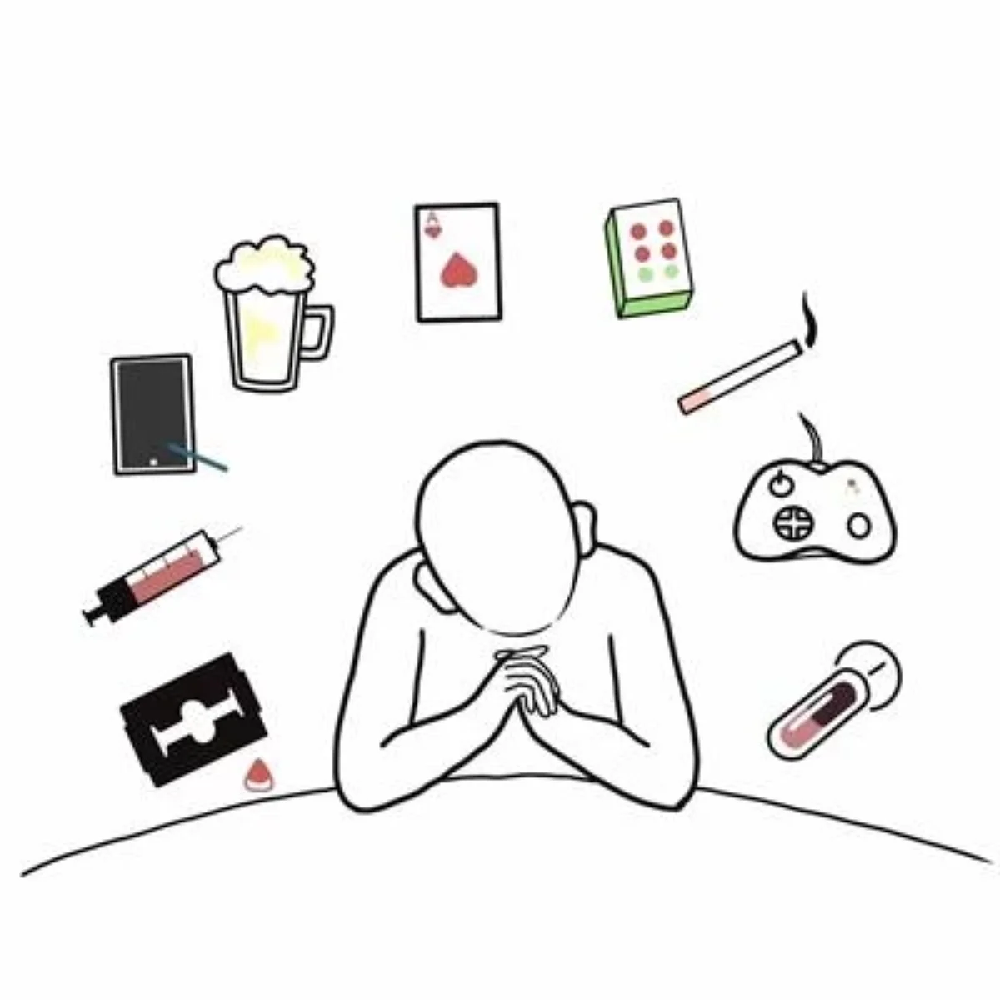
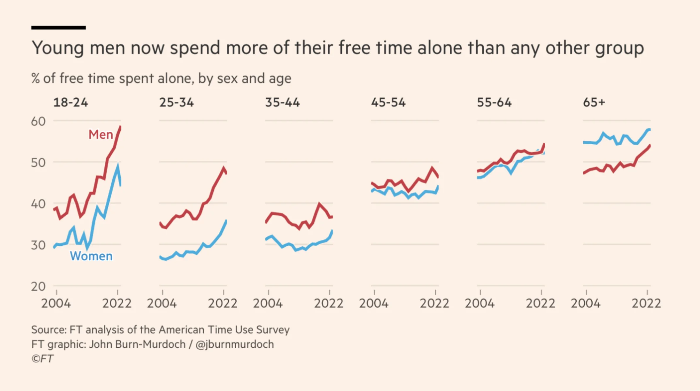
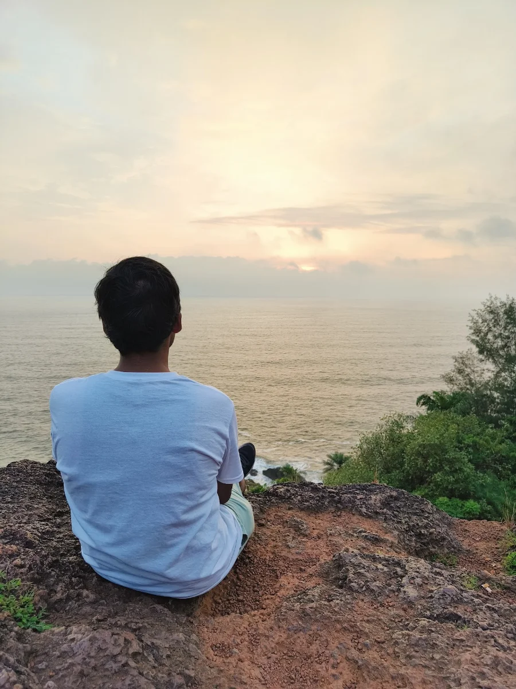

Now, this might have already raised your eyebrows to their maximum extent possible. The reason I am writing it is because:
- I have been through it and I want to talk about it
- I had a friend call me telling how lonely she felt
- I feel its important to talk about it because nobody else is doing

There are a few things I did that helped me out and probably can help others also facing similar situations.
>We all are very much alike, even though different in subtle ways.

So let's talk about loneliness today: why does it creep in and what can be done about it? But first, a little context on what happened with me.

## What happened?
So I'm cracking on the [distributed systems](https://blog.king-11.dev/posts/efficient-gossip-distributed-systems/) challenge when my friend calls in, I didn't pick up the first time (classic Lakshya), I called her back to hear her sobbing a little.

She told me she was feeling **lonely** and tried to reach out to her friends but none of them picked up except for me because of course I'm awake at 6:30am every day.

I can sense that she was feeling *empty* and that's when it hit me that it happened with me, her and there would be so many others so why not talk about it.

I faced a lot of it when my brain was going rampant after my *first breakup*. Feeling incomplete, desire to reconcile, scrolling through memories, etc all emotions came bubbling together like a ~~shit~~ storm.

Now for start let's begin with clearing up the biggest propaganda
>Loneliness != Being Alone

## What is loneliness?
Let me first define what loneliness is before we dive into it (not literally).
 >Loneliness = Alone + Self Pity

If you find it difficult to just be with *yourself*, feel the constant tug to keep yourself *occupied* with something or *surrounded* with people because being alone and unoccupied is **scary**, then my dear friend there is something wrong there.

All the above are ways to distract ourselves from feeling **empty** and **lonely**. People have been doing this for ages and at times using addicition (cigarettes, alcohol, drugs, etc) as a coping mechanism.

Those *seemingly healthy* looking alternatives like excessive working hours, intense gym routines, obsessive video gaming, etc are also no good.

If you have never felt these emotions let's try this, stay still and quiet without doing anything for 10 minutes. No music, book, walking, etc just pure stillness then come back.

Sometimes there falls an idea upon us that we are **incomplete** and need someone to complete us. It originates from this feeling of loneliness.

:::caution
Feeling incomplete does pull a lot of people into *toxic relationships*.
:::

Loneliness doesn't creep in because of the outside perception. It creeps in from **inside of you**, when you let the outside perception cloud your own perception and turn into self pity.

## Why is it on a rise?

While it's common for both men and women to feel this, it's more predominant in the male species as you can see from the graph.

Men in particular struggle to express deep feelings and form meaningful connections because its difficult to be vulnerable when society has taught you to act *strong* over the years.

There are a lot of reasons but the primary one I feel is not knowing

:::note[Question]
What you want from life?
:::

Not creating the life that we want for ourself is what leaves us with the feeling of incompleteness.

In the past we were surrounded by our family or college friends, but after migrating to pursue our careers away from our homes we are bound to encounter these difficult moments of quiet where the [Daydreaming brain](https://www.youtube.com/watch?v=oiAQlDBJ88U) takes over.

### Daily Rituals
Most of us are either in a 9-5 job or a 9-9 job. A large part of our week gets occupied with work and after that most of us hardly have any energy left to do something.

So, we take the easiest route out and start scrolling and consuming content. Do you ever feel satisfied after having doom scrolled hours of reels?

:::warning
We were never meant to consume so much content, instead we were meant to be producers.
:::

On weekends we are either with our friends, partying, or sleeping. The question that arises is

:::important[Question]
When are you connecting with yourself?
:::

Many people find it easier to be in an *intoxicated* state to even think/speak about the bottled up feelings.

### Connected World
I have observed this so many times now that even if there are people sitting together and there is a slight moment of boredom or silence everyone picks up their phones.

:::tip
Observe it the next time you are with your friends.
:::

Generation Z, that is us, is so preoccupied with the online world of ours that we forget to nurture and build those IRL bonds.

Online frienships might feel real, but they are just an imitation of what our brain actually desires, which is human contact.

In our childhood we were aware of our neighbours and people around us. Today, I hardly know who is living in the flat opposite to my house. I haven’t had a meaningful conversation with a neighbour in two years. In future, I don't think I would know whom to ask to take care of my pet when am going out.

## What to do?
The first step in making a better life for yourself is recognising the parts that aren't going so well.

The next step is working on improving them actively rather than just pitying yourself passively.

### Hobbies

:::important[Question]
How many of us have forgotten that we had such amazing hobbies as a child?
:::

For a moment can you reminisce, about what all activities kept you engaged in childhood and now most of them are gone, right?

Engage in your hobbies again, that's the best way to build **a life around yourself**. Start small; it can be anything: video games, cooking, reading, running, hiking, badminton, art work, painting, crochet etc.

:::caution
I wanted to say gym counts but it doesn't to be honest. Gym just doesn't feel like hobby, or does it?
:::

It's definitely difficult to build hobbies as an adult, but step out of your mobile phones and comfort of the bed, there is so much you can do with the precious time which will **enrich** your life far more.

You might be thinking how do I play badminton alone Lakshya? Well there are sports group if you just start looking.

>Don't wait for others; do it alone, and others will join later.

I have personally picked up on reading books, blogging, video games, cooking and whenever possible badminton. Most of these were picked up from my friends, so look out what they are doing.

### Me Time
The next essential step is to put the phone down and connect with yourself. Give yourself time, **10-15 mins** daily and let the thoughts flow.

:::warning
You have neglected yourself long enough.
:::

*Don't let them be interrupted* by notifications, external objects or desire to engage in other activities.

There may come many weird and intrusive thoughts but it's your brain at the end of the day. You need to sit with it to see how it functions and develop a better **understanding of yourself**.

In this time engage with yourself ask questions, find answers, identify your likes/dislikes, etc. If you want to read further on this I highly recommend reading [The Art of Being Alone](https://www.goodreads.com/en/book/show/152297026-the-art-of-being-alone)

>Do things you want to do with others.

The most impromptu thing I did for "_me time_" was doing a solo trip to Gokarna. You can read more about it in my [travel blog](https://blog.king-11.dev/posts/around-the-world-2024/#gokarna-karnataka).

## Wrapping Up
The next time you feel lonely, call a friend or even your mom/dad don't hesitate. For short term people will help in filling the holes, but in long term it's you who has to fill in the voids left.

While society looks down on **boredom** and **alone** time, I am asking you now to engage in exactly those two to build a more fulfiling and self sufficient life for yourself.

**Loneliness** is a difficult emotion to tame but most of the times all we need is to face our emotions head first and start acting on them rather than being *subdued*.

That's all folks, I have been wanting to share my learnings which happened in the last 1-2 years as an **adult**. This article was the attempt at sharing my ways, similar to this I'm working on another article which talks about *"how to gain our attention back"* rather than scrolling through dancing huskies on instagram.

Thanks for giving this article your interrupted attention.

