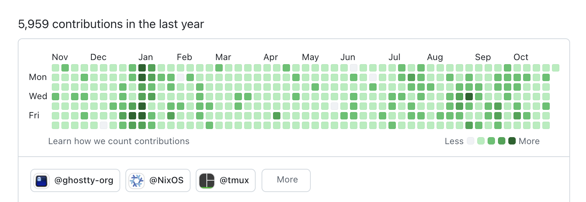
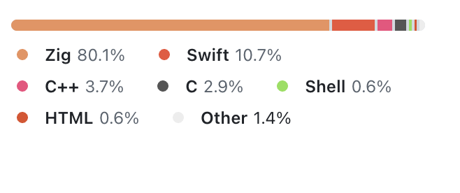
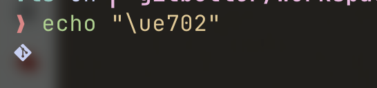
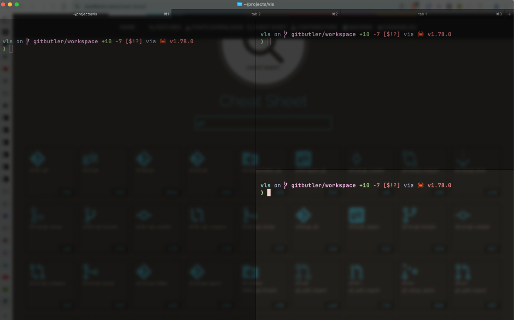
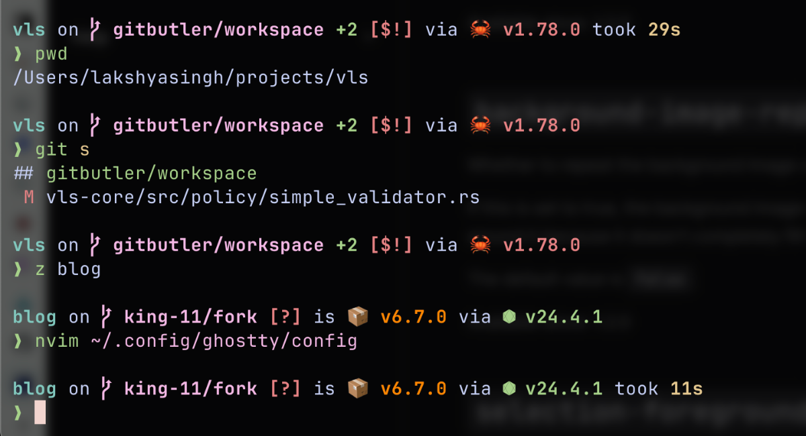

Developers spend a lot of their time in terminal running trivial commands to complex applications like Claude Code or Codex. Making it an aesthetically pleasing experience is a must!

I have spent countless hours trying to build a smooth, speedy and pleasing terminal experience messing with different **terminal emulators**, **shells**, **plugin managers** and **shell prompts**. In this article I will cover the details of ones that I use and their configuration.

## Terminal Emulator
In past, I have tried out the default Ubuntu Terminal, GPU accelerated [Alactritty](https://alacritty.org/) and [Kitty](https://sw.kovidgoyal.net/kitty/) by [Kovid Goyal](https://github.com/kovidgoyal).

Finally, I have landed on something that was developed by a developer I look up to, **[Mitchell Hashimoto](https://github.com/mitchellh)**.


Above is what Mitchell's Github contribution graph looks like. When a person on *sabbatical* spends so much time developing and contributing out of shear **passion** then something amazing was bound to come.

The result of which was a cross platform, fast and feature rich terminal emulator, **[Ghostty](https://ghostty.org)**. It aims to be zero config, uses **platform native** UI and **GPU acceleration** which makes it super fluid, non-clanky and performant.



:::info
It's written in [zig](https://ziglang.org/) one of the new system's programming language that is picking up pace as a `C` alternative.
:::

It comes built in with JetBrains Mono Font and has out of the box support for **nerd fonts** which can render glyphs in terminal.


### Terminal Multiplexer
At some stage everyone becomes aware of terminal multiplexers like [tmux](https://www.man7.org/linux/man-pages/man1/tmux.1.html), [zellij](https://zellij.dev/), etc. These cli tools allow you to open multiple shell sessions in a single terminal emulator window.

Ghostty comes packaged with support for **tabs** and horizontal/vertical **splits**.


This makes the whole multiplexing experience **native** to terminal emulator without needing to learn any new commands or shortcuts.

This also helps in preventing **shortcut conflicts** that happen due to multiple task mapping to same action.

### Configuration
Ghostty is supposed to be minimal in config but I have set in some basics that are very niche options.

My theme of choice is [Catppucin](https://catppuccin.com/), a very soothing pastel colored theme.
```
theme = Catppuccin Frappe
```

Next up is font, I like 'em large and also it should be a **nerd font**.
```
font-size = 16
font-family = "JetBrains Mono Nerd"
```

I prefer my cursor to be `block` style which is more visible and for this we also need to override the shell from choosing the cursor style. Also to attain **flow state** while working I want the mouse cursor out of the way.
```
cursor-style = block
shell-integration-features = no-cursor
mouse-hide-while-typing = true
```

I theme my background to pitch black (`#000000`), with some opacity reduction and a very cool **blur**, which was visible in all the screenshots.
```
background = #000000
background-opacity = 0.65
background-blur-radius = 15
```

## Shell
While macos comes natively installed with [zsh](https://www.zsh.org/) (Z Shell) in ubuntu they are still using [bash](https://www.gnu.org/software/bash/) (Bourne Again Shell).

In terms of functionally both are equally capable for day to day task. The biggest change is `zsh` is very customisable due to it's plugin ecosystem and themes.

>Aesthetics's are important!

So the first step that I take on a fresh install is to switch the shell.
```bash
sudo dnf install zsh
chsh -s $(which zsh)
```

[chsh](https://linux.die.net/man/1/chsh) command is acronym for "change shell" and the `-s` for specifying the shell binary to be used.

[which](https://linux.die.net/man/1/which) command is used to find the location from where the binary is getting loaded.

:::info
`dnf` is the package manager for [fedora](https://www.fedoraproject.org/) linux (my linux distribution of choice)
:::

## Plugin Manager
Now that we are done with setting up our emulator and shell of choice we can finally start bringing in some plugins to add more information to our shell.

I use [zcomet](https://zcomet.io/) instead of something like [zplug](https://zplug.github.io/) or [oh my zsh](https://ohmyz.sh/) because it is **fast**.

:::note
I was using [zinit](https://github.com/zdharma-continuum/zinit) which was the fastest but I found [zsh-bench](https://github.com/romkatv/zsh-bench) which is a more comprehensive comparison of shell prompts and plugin managers.
:::

Installing **zcomet** is done by adding following lines in `zshrc`
```bash
if [[ ! -f ${ZDOTDIR:-${HOME}}/.zcomet/bin/zcomet.zsh ]]; then
  command git clone https://github.com/agkozak/zcomet.git ${ZDOTDIR:-${HOME}}/.zcomet/bin
fi

source ${ZDOTDIR:-${HOME}}/.zcomet/bin/zcomet.zsh
```

## Shell Prompt
I was using [powerlevel10k](https://github.com/romkatv/powerlevel10k) a very optimised shell prompt for fast loading. But it isn't very customisable and isn't getting maintained so I made peace with using [starship](https://starship.rs/).


It's a shell prompt written in rust which is being actively maintained. I had set it up using **zinit** but for **zcomet** I have to use it's native setup.
```bash
brew install starship
echo 'eval "$(starship init zsh)"' >> ~/.zshrc
```

I have a pretty lean config for it which just disables output from `git` status as my directory is mostly dirty and it also slows down the startup.
```toml
[git_status]
disabled = true
```

:::info
`p10k` allows for asynchronous execution of `git status` making it very fast to load unlike `starship`.
:::

I think that's all you need to built an aesthetic and pleasing terminal experience. This is just the start though there is plethora of plugins and themes to look around.

:::warning
Adding too many plugins will slow down shell load times and prompt rendering.
:::

While this article was more about *eye pleasing,* in case you want to know what shell utilities I make use of to fly around and get things done quickly let me know, I might just write another article on it.

That's all for this article, thanks for reading you can find more of my articles on my [blog](https://blog.king-11.dev).

Cover Photo by [Kris Atomic](https://unsplash.com/@krisatomic).
