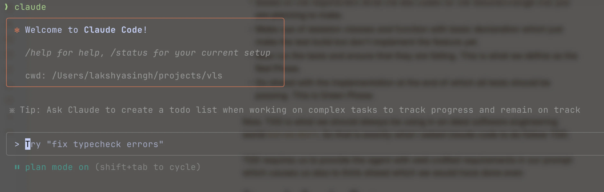

I remember talking with my ex-manager [Jatin](https://www.linkedin.com/in/jatin-puri-2788aa11/) about Vibe Coding and how cliched this term seemed back in March 2025, but our industry moves fast.

I have been pushing Claude Code, my tool of choice, to the edge. I have:
- burnt my hand with AI Agents by pushing bad code in production
- tried multiple AI agents to finally land on my current choice
- had immense success in moving fast by leveraging these tools
- learnt from others on how they are using it
- devised a flow that works pretty well for me

Let's dive into how I came upon my choice of agent, using **TDD** and *planning* for improving the precise path to complete a job, sprinkling `keywords` to improve the *"thinking"*, configuring tools and much hyped **MCP servers** and finally I share a few of my frequently used prompts.

## Why Claude Code?
Let's rollback a little the first AI coding assistant that I used was **GitHub Copilot**. It was ahead of its time but has *fallen behind* now. Copilot was able to provide a very nice autocomplete support in the past and also the chat was useful enough to act as a pair programmer.

Even though the completions were good for common patterns found in codebases I **stopped** with autocompletion by AI extensions in my IDE altogether. The primary reasons were:
- It halted the activation of my *flow state* where I was continuously waiting for the AI to do its job which it does sometimes and sometimes doesn't.
- There was also increasing reliance on **autocomplete** which prevents me from learning the correct syntax because if _"I don't write it, I won't ever learn it"_.

All these ideas were also gathered by others like Luciano in his blog: [Why I stopped using AI code editors · Luciano Nooijen](https://lucianonooijen.com/blog/why-i-stopped-using-ai-code-editors/). So no more auto complete in the IDE.

For sometime I tried using chat interface of Github Copilot for correcting code and asking for suggestion whenever required. I also tried **Cascade** by [Windsurf](https://windsurf.com/) in Intellij but that didn't work out well because the agentic flow in these tools wasn't working great at the time.

I never went ahead with [Cursor](https://cursor.com/) because given it's a VSCode fork the support for Java, my primary language work at work isn't very well supported in it.

:::tip
I also suffer from the habit of trying niche things as compared to mainstream things that are often hyped too much.
:::

So my reluctance to learn a new IDE because of familiarity with shortcuts and controls coupled with not using auto completion is what lead me to **Claude Code** which had the basic features I needed:
- Auto Edit Mode
- Ability to run test and build commands for verification

:::note
Given I have been working with the agentic tools more my demands have increased from the basic ones that I listed above :P.
:::

Now, let's see how I reached to my current workflow and what learnings were there in the process which helped me identify a better workflow incrementally.

## Test Driven Development
TDD was introduced to me by my mentor Vicent when I did my LFX project with [Vitess](https://blog.king-11.dev/posts/lfx-report/). In case you are not familiar TDD it looks as follows or otherwise skip ahead:
- Based on the requirement write the test cases for the feature/change that you are planning to make.
- Make use of skeleton classes and function with basic declaration which just make the test build but don't implement the feature yet.
- Now run the tests and ensure that they are failing. This is what we define as the Red Phase.
- Go ahead with the implementation at the end of which all tests should be passing. This is Green Phase.

Now, TDD is what we should always be using in an ideal software engineering world ~~but we don't~~. So that is exactly what I asked claude code to do follow TDD.

TDD requires us to provide the agent with well-crafted requirements in our prompt which requires us also to think ahead which we would have done even if there was no LLM so why should this be any different.

### Story of a Passing Test
The story behind choosing TDD is when I had ~~accidentally~~ pushed bad code to production and it was there for quite sometime. I had written the code myself but the reluctance of SWEs to write tests got the better of me and I offloaded it to claude.

It did write very well in terms of the test cases I was happy and the code got merged. Only later did I realize that my code was wrong and claude had force-fitted the assertions to ensure tests pass which is what I had asked it to verify.

That's why I find that reversing the behaviour prevents force fitting of test cases to the code written as well gives us and Claude both a chance to think through requirements first.

## Plan Mode
This was something I became aware of while reading the [document](https://www.anthropic.com/engineering/claude-code-best-practices) made about prompting by the anthropic team around best practices for Claude Code.



So before starting any task I will make sure to but claude into plan mode (Shift + \<TAB\>) based on the requirements provided, it generates a plan which we can reject and ask it to reiterate on until we are satisfied.

### Using Keywords
The one important thing that [best practices](https://www.anthropic.com/engineering/claude-code-best-practices) document mentions is the use of words like:
- think
- think hard
- think harder
- ultrathink

These start extended thinking mode for claude and are mapped to increasing levels of increasing budget so based on ~~your pocket~~ the complexity of task you can make sure to put one of these while asking it to generate a plan.

### Reviewing the Plan
Getting claude to review my plan was something I picked up from twitter. This workflow is something I recently included in my flow, even though it requires a little more seconds.

So after claude has completed the plan creation and you are mostly happy with it:
- Approve the plan and ask it to move into edit phase
- Halt the edit phase using `Esc` key
- Ask it to write the complete plan in a markdown file
- Now using `/clear` command, clear the context
- Go back to plan mode, prompt claude to review the plan generated, identify any issues or misses and correct them
- Now once again `/clear` the context and in auto edit mode ask claude to implement the generated plan.

:::tip
You can use `@` for referring file using auto complete in code. There is a [bug](https://github.com/anthropics/claude-code/issues/1397) around dangling soft links and large repository.
:::

The above process helps in two ways it keeps the *context window* small as after reading already generated plan claude won't go into exploration mode keeping its implementation limited to certain specific regions of code.

The second thing it helps with is the second reviewing claude prevents **hallucination** given its an extra layer of *filter* with fresh context.

## Sub Agents
I had experienced this earlier where claude code was making use of running **independent** subagents to complete the plan faster but after a few updates stopped doing it. I also forget about this feature.

Recently one of my colleague [Raymond](https://www.linkedin.com/in/raymondcarino/) pointed it out that sub agents is something that can help in context reduction as its not shared with main agent. While that is a great addon but the biggest one is **explicitly** asking claude to use sub agents for running indpedent tasks concurrently reduces the *time to completion* a lot.

## Configuring Tools
Claude Code configuration can store details about what tools we allow it to use automatically without asking for confirmation and what is disallowed. Here is what it looks like
```json
{
  "permissions": {
    "allow": [
      "Bash(bazel build:*)",
      "Bash(gh pr view:*)",
      "Bash(gh pr diff:*)",
      "Bash(ls:*)",
      "Bash(rg:*)",
      "Bash(grep:*)",
      "Bash(find:*)",
      "Bash(fd:*)"
    ],
    "deny": [
	    "Bash(rm:*)"
    ]
  },
  "enableAllProjectMcpServers": false
}
```

Having an allowed set of tools allows you to spend less time monitoring the approval requests claude code will send.

:::tip
Definitely have `rm` blocked a few colleagues had it running `rm -rf **/**`
:::

The second thing that I found useful were configuring a few `MCP` server, they are:
- [context7](https://github.com/upstash/context7) provides latest documentation for libraries being used in the code.
- [glean](https://github.com/gleanwork/mcp-server) is useful for searching and fetching internal documents e.g. gdrive, confluence, jira, etc.
- [playwright](https://github.com/microsoft/playwright-mcp) is particularly useful for frontend developments as it allows the agent to access browser view, console, etc.

## Improving Context
The presence of a `CLAUDE.md` really helps claude to develop context on what code parts to work on, which tools to use, etc.

We have defined a lot of these specifications given that at Glean we use a monorepo but having only the ones important for my task keeping the context **precise** is generally better.

## Predefined Prompts
I have some snippets defined in [raycast](https://www.raycast.com/) that I quickly drop in for something like plan creation with `TDD` I use below prompt:
```
Write the comprehensive plan in plan-<SHORT_NAME>.md file first
- what is the issue,
- the goal,
- the idea,
- the implementation touching upon what all files to modify
- and how to write test

Be as particular as possible in the plan.

Proceed in a test driven manner.
- write tests first considering all the business requirements,
- next ensure that build is passing using skeleton structs and functions
- now ensure that tests are failing as we haven't completed the implementation yet.
- finally write the implementation and make sure tests are passing now
```

For reviewing the plan I use the below one
```
Review generated plan file and update any misses if its not complete or incorrect
```

## Wrapping Up
I expect my workflow to change over time as and how the tools start responding to my current workflow but I expect less *engaging* workflows over time as LLMs gain more and more context about the way we work.

But for now its very important to treat them as those *little interns* who will run around doing random things if you don't provide the precise **requirements** and **context** to complete the task.

:::important
USE BETTER PROMPTS!!
:::

That's all for now, please do reach out to share your ideas on how you have had success in working with AI agents I am always looking for ways to be more efficient with these tools. I will see you on the other side of **AI revolution**.


