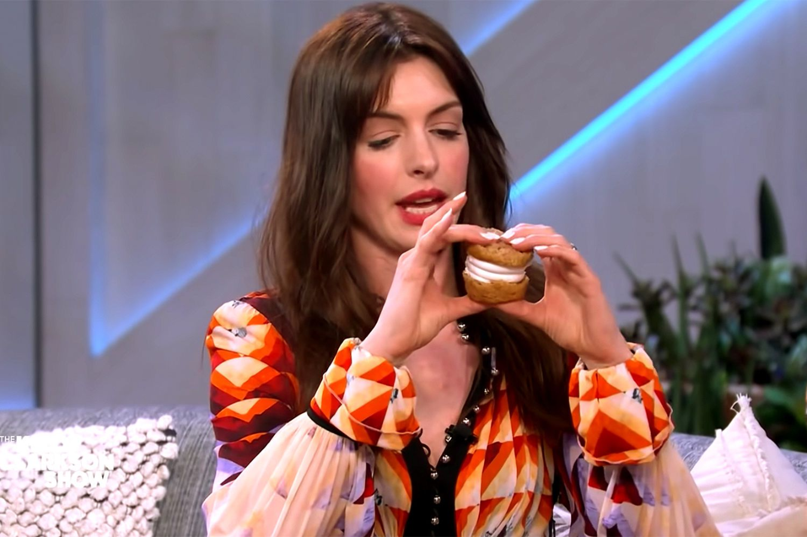
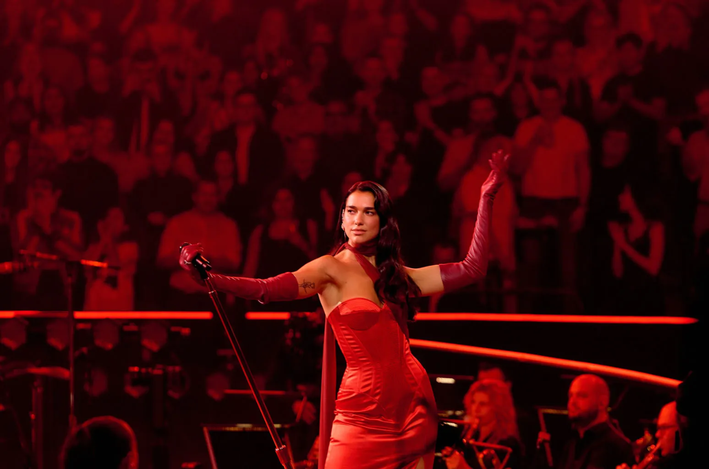
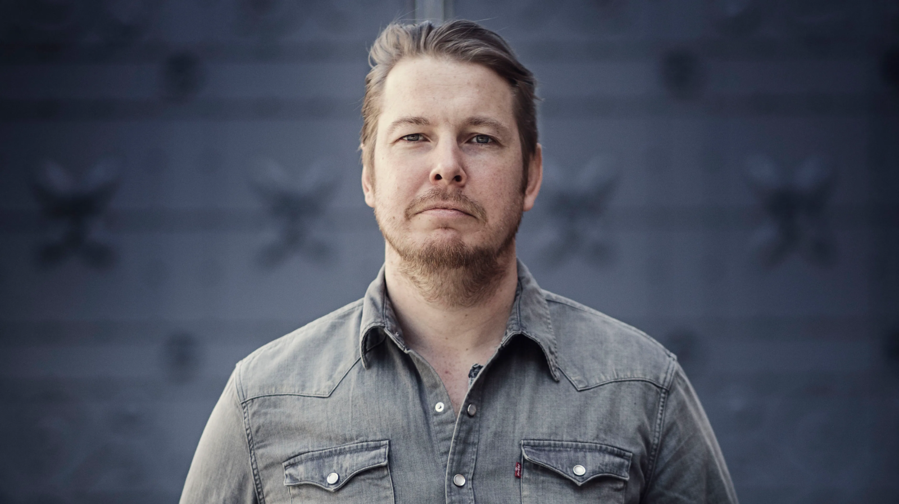
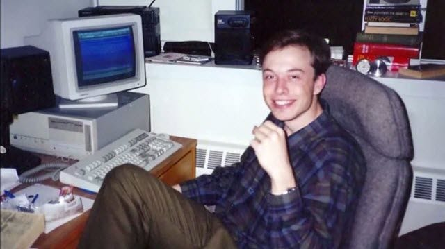
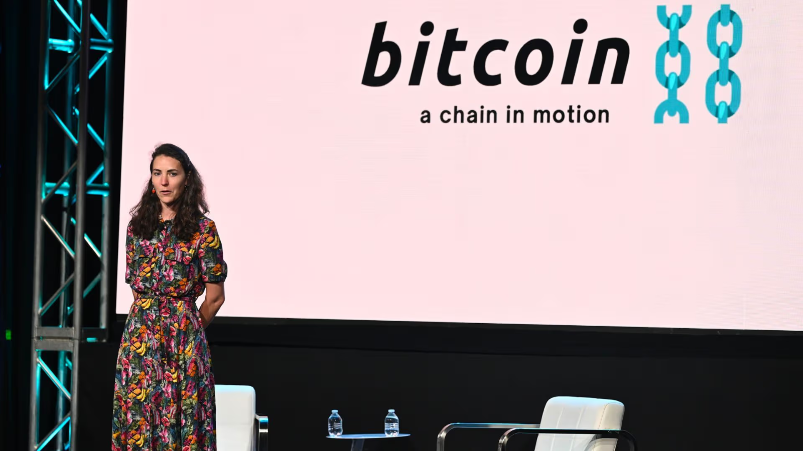
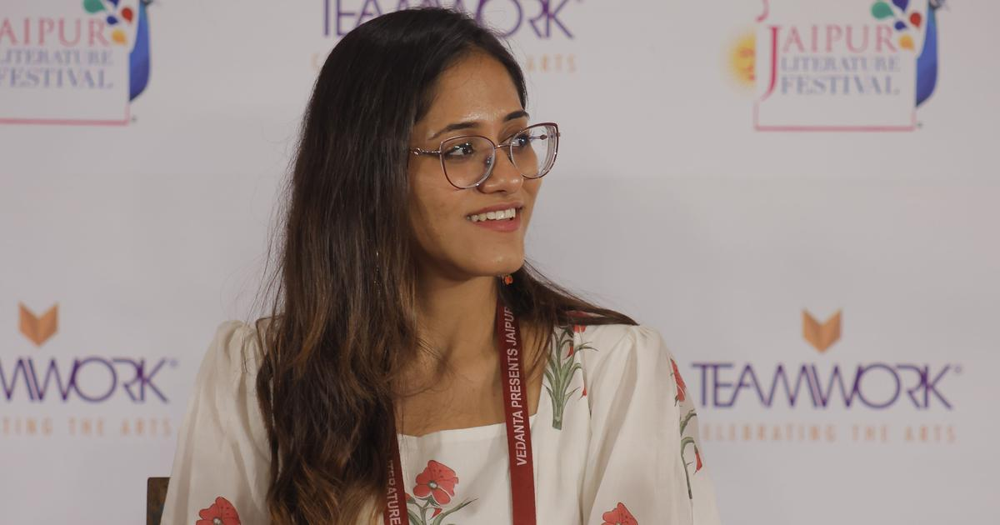
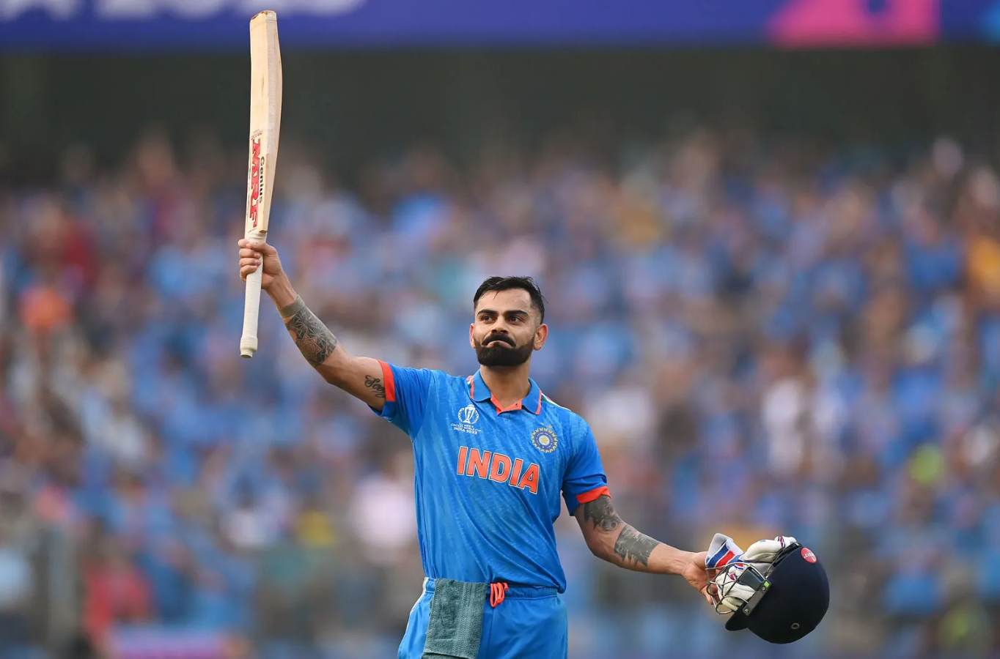

I came across this question on social media from an account named [@hustlerani](https://instagram.com/hustlerani), and that was basically

:::question
Who would you call for dinner if you can invite anyone?
:::

The only condition is you are limited to **eight people** apart from you. This got me thinking because selecting **8** out of **8 billion** people is a very small subset.

:::important
I'm, of course, cutting out my family and friends right away from the table because it's very hard for me to select only a few of them.
:::

I spent some time thinking on it crossing and adding a few names. Finally, this is what my list looks like:
- Anne Hathaway
- Dua Lipa
- Elon Musk
- Fredrik Backman
- Linus Torvalds
- Lisa Neigut
- Ria Chopra
- Virat Kohli

This blog is about _why_ I would want to share a meal with these people. The key thing I am optimizing for is how **interesting** the conversation over dinner would be and it should be time **well spent** for everyone.

## Anne Hathaway
The reason for Anne Hathaway is I'm just amazed by how that woman has just defied time. It doesn't seem like she's growing old anytime soon. I just want to discuss with her the secret of eternal youth and her skin care routine of course.

:::important
She is funny, blissful, warm and elegant. She's an absolute diva.
:::

At the same time, I also look up to her because she seems like a really nice person whenever she is talking to anybody.

Her movies are a cinematic experience. Maybe it has to do with the fact that **Dark Knight** is my all time favorite that I adore her so much.

She usually does the _girl next door_ kind of roles like in the **The Princess Diaries** but can pick on anything like she is doing with **The Odyssey**, coming soon.

**Special Dish**: I will make sure to bring in some cupcakes so that we can see her do the thing which whole world is copying now iykyk!

## Dua Lipa
I have played Dua Lipa's songs on repeat for a whole year every morning, my roommate at that time, [Shubhanshu](https://www.linkedin.com/in/shubhanshu-saxena/), could vouch for it.

I missed my chance at meeting her when she was in **Jaipur**. I was also in Jaipur at the same time, but I was _off social media_ during that time. So it was too late when I got to know, otherwise I would have gone to meet her definitely!

When she came for the concert, I didn't go because I didn't have the right set of people to go with at that time. Maybe next time when she comes I might even go solo because her **concerts** are riddled with bustling **energy**.

She faced a lot of backlash for her pencil sharpener move but she turned that around and her concerts are lit!

She met her fiance while reading a book and they were on _literally the same page_. My friend [Akanksha](https://www.linkedin.com/in/akanksha-verma-4b0b2b1a4/) and I have talked about it so many times, that this is the kind of thing we would want to happen with us someday.

**Special Dish**: She said she likes Rajasthan a lot, so maybe _"Gatte ki sabzi"_ would be there and no water of course :P

:::info
Dal Bati Churma is too heavy and only for feasting or special occasions.
:::

## Fredrik Backman
Fredrik Backman is my favorite author. I have felt very good and felt a new thing inside of me after every book.

I think I started reading with [The Answer Is No](https://www.goodreads.com/en/book/show/219876684-the-answer-is-no), then I read then I read [A Man Called Ove](https://www.goodreads.com/book/show/18774964-a-man-called-ove?ref=nav_sb_ss_1_14) and finally [Anxious People](https://www.goodreads.com/book/show/49127718-anxious-people).

:::info
I'm planning to read [Beartown](https://www.goodreads.com/book/show/33413128-beartown) soon!
:::

All of these books are really [funny](https://www.youtube.com/watch?v=NSuSyZ92Cjg), filled with satire and they touch human emotions at an exceptionally **intimate** level.

The focus of his books is very much on the **growth arc** of characters rather than story itself. The way he brings about his characters, who all have very different _colors_ and _personalities_ while all being equally humane.

I would really like to have him at the dining table because a person like that has a lot of **perspective** on humans and life in general. The number of people he must have met in life must be huge with quite some variations.

**Special Dish**: Swedish cuisine is very famous for meatballs I have tried them out in Ikea Hyderabad they are amazing. An Indian dish which is very similar to meatballs is **Malai Kofta** so that would be it for him.

## Elon Musk
Elon Musk, is just a crazy ~~rich~~ man, and I remember this quote that

:::quote
The people who are crazy enough to think they can change the world are the ones who do. — Steve Jobs
:::

Whatever people may call him, womanizer, jerk, controversial, right wing (I don't mind this), but he is just an **exceptional creator**, entrepreneur and engineer. He is a nerd at core who was looked down and bullied in school.

After his acquisition of Twitter and laying off _80%_ of the task force, to everyone's surprise the platform is still running.

All his companies **PayPal**, **SpaceX**, **Tesla**, **xAI**, etc. build very innovative products that people actually keep coming back to, so I am curious about

:::question
How does he figure out the right problem to solve?
:::

I read somewhere that in your life you can only have so many of these _burners_ on, for him it was turning on career and health while he turned off family and relationships.

I try to lead life not entirely but in some ways opposite of his way, for me career comes after family and relationships. I would like to see things from his point of view though.

:::question
Is he satisfied with his way of living?
:::

**Special Dish**: He said in one interview if he could eat something for lifetime it would be cheese burgers. Something that might resemble a burger would be **Dabeli**, filled with cheese of course.

## Linus Torvalds
How can I not, right? Linus Torvalds is the guy I have **looked up** to since I have joined college and got to know about open source and Linux.

He's the creator of the **most** widely used operating system kernel in this whole world. He also created [git](https://github.com/git/git) to cater to the requirements of remote collaboration.

He's very rigid in his ways. He seems a bit like the character Ove in [A Man Called Ove](https://www.goodreads.com/book/show/18774964-a-man-called-ove), so I think he will like Fredrik's company quite a bit.

:::info
He built something because he wanted it, shared it with everyone, and that's how the whole culture of open source started.
:::

It's a bit messed up these days because people are just _vibe-coding_ things without paying respect to other people's carefully crafted projects. I don't feel there's substance to vibe coding if you are doing it without putting in any thought.

I would like to take his view on the shift of open source, how he's working with the Linux kernel these days, how he's protecting the Linux kernel from these vibe coders.

He never really got into the corporate world and became a manager. He doesn't orchestrate people but definitely guides them like a lead. I would want to understand how he went about **choosing paths** in his career.

:::info
In terms of position he can very well be Distinguished Engineer in some big software company.
:::

**Special Dish**: He seems to like [chinese](https://www.cnet.com/tech/computing/top-10-geek-recipes/#:~:text=Linus%20Torvalds%2C%20the%20inventor%20of%20the%20popular%20Linux%20operating%20system%20has%20said%20that%20his%20favourite%20foods%20are%2C%20%22Hot%20Indian%20or%20Thai%2C%20Chinese%20is%20fine%2C%20and%20good%20meat%20that%20says%20%27moo%27%20when%20you%20stick%20it%20with%20your%20fork.%22) and hot Indian food. For him something spicy it is so we would be going with **Paneer Tikka Masala**.

## Lisa Neigut
I don't think a lot of people might be aware of her because she is primarily famous in the tech community surrounding Bitcoin and the Lightning Network.

She goes as [@niftynei](https://x.com/niftynei) on `X` and other social media handles.

She leads quite some communities and organizes **bitcoin conferences** around the globe. She is very respected in the technical forums and is one of the _women in tech_ I look up to.

She is very humble for someone so smart. I didn't see a single shred of arrogance in my brief interactions with her when I went for [BTC++ Austin, 2024](https://btcpp.dev/conf/atx24#:~:text=Lakshya%20Singh,Validating%20Lightning%20Signer).

It would definitely be nice to have someone who is working on fostering an economic shift for the future and is a true cyberpunk at heart.

:::info
She creates some pretty fun vlogs whenever she is traveling to different places while organizing conferences.
:::

**Special Dish**: She is from Austin, Texas and everyone loves Barbecue over there but we aren't having steak. So the alternative would be well cooked mutton something like **Laal Maas**.

## Ria Chopra
Ria is one of those rare _intellectual nerds_ you can find on Instagram. She still makes **long form** content which might not please the 10sec [doom scrolling](https://blog.king-11.dev/posts/scrolling-death/) crowd but is very enriching to listen or watch.

Her content has **substance** and **intent** unlike what I can say for most creators on internet. She shares interesting facts she found out about, talks about her interesting experiences and lores.

:::important
While AI may be able to create other forms of content it can never match the emotions of a human narrating their experiences.
:::

She recently wrote her first book [Never Logged Out: How the Internet Created India's Gen Z](https://www.goodreads.com/en/book/show/244484834-never-logged-out), I still have to read it but she connects with our generation because she belongs to it and has gone through the shift we did.

I don't follow any Instagram celebrity because I treat it as social media was meant to be _"to interact with my friends"_, but from time to time I stumble upon her content and *intentionally* visit it also.

The tenant at my home read my blog on [happiness](https://blog.king-11.dev/posts/pursue-happiness/) and asked me _when would I be writing my first book?_ I was flattered beyond imagination and am thinking about it. I remember [Shriyanshi](https://www.linkedin.com/in/shriyanshi-bhadada-766778201/) also told me to write a book sometime back. So, it would definitely be interesting to discuss writing a book with her.

[Fredrik](#fredrik-backman) has also shared his inability to reason about our generation's working maybe these two will have some interesting discussions.

**Special Dish**: This was the most difficult one to figure out. Even though she is a content creator it's mostly not about her food choices and you can't do semantic search or transcript matching on reels. So, I instead went with querying [X](https://x.com/search?q=from%3Ariachops%20dish&src=typed_query&f=top) and got a few names. She seems to like **Apple Crumble** so that is what we are making.

## Virat Kohli
We have people from all industries *tech*, *movies*, *music*, *books*, etc. except *sports*. When you think of sports, the names that dash through your brain would likely be people from **cricket**, right?

I don't know how people in industry meet their **right partner**, but he seems to have a very loving wife, who is always there supporting him in all of his crucial moments and vice versa too. He transitioned from an angry young man, to the not so angry anymore father with two young kids.

:::question
He is currently at 85 centuries I wonder if he still thinks about getting to 100 centuries?
:::

He is someone who holds the heartbeats of so many Indians, when he doesn't score a hundred, **rage** erupts around the whole country.

He has seen a fair share of _backlash_ when his captaincy wasn't going well, when his performance wasn't going strong, and he came back **stronger** every time.

He recently moved to **London, United Kingdom** for a better lifestyle and a more private life. I would like to talk more with him about what went into his decision because this is something that frequently comes up in my mind as well.

**Special Dish**: We know he is a Delhi guy, so for him we'll have **Rajma Chawal**.

## Final Notes
I did this activity because it is *stimulating* to think about and filter down to just a few people and explain the basis of that decision. Also maybe a few years down the line I would have a different list and would look back on this one to see what **changed**?

I feel the answer to this question can also help us gauge the person we are interacting with at a much more *granular level.* Maybe it's worth creating a dating app on this question itself that matches people based on it xD.

Try it out yourself and maybe you can share your answers with me, I would love to hear it! Also take care in this scorching summer, don't forget to have some water and apply sunscreen.

Cover Photo by <a href="https://unsplash.com/@skv_creates">Stefan Vladimirov</a>
