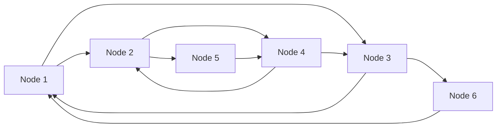

I have been interested in distributed systems for quite some time. Recently, I started solving the **[Fly.io Distributed Systems Challenge](https://fly.io/dist-sys/)** after putting it off halfway through. Amongst the challenges the **[Broadcast](https://fly.io/dist-sys/3a/)** challenge revolved around getting a better understanding of how to make *fault resilient*, *consistent* and *efficient* distributed system for broadcasting messages.

Through this blog I will try to share my learnings and thought process solving the challenge which includes identifying the use of **gossip**, reducing message passing **latency** and finally doing efficient **network** communications.

## Broadcast System
In this broadcast system we have `n` server nodes and some clients which send requests to our servers.

The possible type of messages that system supports as **Remote Procedure Calls (RPC)** are:
- **Read**: In response to this the server should return all values it has seen till now.
```json
{
  "type": "read"
}
```
- **Broadcast**: The value sent in broadcast should be stored locally by the server.
```json
{
  "type": "broadcast",
  "message": 1000
}
```
- **Topology**: This message informs the node of who its neighboring nodes are.
```json
{
  "type": "topology",
  "topology": {
    "n1": ["n2", "n3"],
    "n2": ["n1"],
    "n3": ["n1"]
  }
}
```

:::note
We can ignore this message and make our own topology from the list of nodes in the [`Node.NodeIDs()`](https://pkg.go.dev/github.com/jepsen-io/maelstrom/demo/go#Node.NodeIDs) method.
:::

We run our nodes on [maelstrom](https://github.com/jepsen-io/maelstrom) using the below command
```bash
./maelstrom test -w broadcast --bin ~/go/bin/maelstrom-broadcast --node-count 5 --time-limit 20 --rate 10
```

## Fault Tolerance
`maelstrom` supports introducing *nemesis*. For this challenge it would be *network partition* where nodes won't be able to communicate for a short period of time.
```bash
./maelstrom test -w broadcast --bin ~/go/bin/maelstrom-broadcast --node-count 5 --time-limit 20 --rate 10 --nemesis partition
```

:::important
The clients will still keep sending `read` and `broadcast` requests to the nodes.
:::

So we have to make sure that values should propagate to all other nodes by the end of the test. We need to worry about values that arrived during network partitions as our system failed to propagate them in face of nemesis.

To make our system resilient to network partitions, we use a technique called gossip. In gossip protocols, nodes *periodically* share information with other nodes to ensure everyone stays up-to-date. The nodes which sees a new value then can further propagate it to their neigbhours.

We introduce a new message of type `Gossip`, as below because the `Broadcast` message would require multiple messages to send all the values.
```json
{
	"type": "gossip",
	"messages": [11, 08, 2002]
}
```

We will run a separate thread that will be invoked at `GOSSIP_FREQUENCY` and select `GOSSIP_NODE_COUNT` number of nodes randomly and send all its messages to them. I kept the values at `2s` and 2 nodes respectively.

:::note
We don't expect the servers to reply back acknowledgement to `GOSSIP` message it will be a fire and forget kind of message so that latency is minimum.
:::

## Reducing Read Latency
The requirements for [Efficient Gossip Part I](https://fly.io/dist-sys/3d/) are as below:
- Messages-per-operation is below `30`, shows the number of messages exchanged per logical operation.
- Median latency is below `400ms`
- Maximum latency is below `600ms`

:::note
The latency here is the time it took for all nodes to see a particular message sent by client.
:::

Along with this there are new configuration as well:
- The node count has been increased to `25`
- Messages have a latency of `100ms` to simulate a slow or busy network.

The most important information that was present in the challenge description was
>The neighbors Maelstrom suggests are, by default, arranged in a two-dimensional grid. This means that messages are often duplicated en route to other nodes, and latencies are on the order of `2 * sqrt(n)` network delays.

The challenge further encouraged us to do what was necessary
>Feel free to ignore the topology you’re given by Maelstrom and use your own; it’s only a suggestion.

So based on the understanding that we need to manipulate our topology I first tried a circular one.


I tried this because I was familiar with [chain replication](https://www.youtube.com/watch?v=IXHzbCuADt0) distributed system. But this didn't perform as expected it was resilient to faults but pretty slow. From complexity analysis we can see it can take as long as `O(N)` for it to work.

So we need something better than linear and square root (grid), the thing that programmers love is **logarithmic**. The data structure which can provide us this is a balanced tree. So I planned to make use of **binary heap** for this where neighbours are defined as below
```go
n := len(s.n.NodeIDs())
n1 := (2 * i + 1) % n
n2 := (2 * i + 2) % n
```

:::important
For resiliency we are allowing back edges in our binary heap so that in case of network partitions we can still process messages.
:::

Just to demonstrate how this looks in a system with 6 nodes


In some cases, our formula results in node itself. This worked fine in my test runs, which implies we can have a little discrepancy in large distributed system.

:::note
It doesn't have to be perfect.
:::

I also increased the gossip frequency and gossip nodes to `5s` and `5` respectively for a larger system to keep message count low.

## Efficient  Network Communication

:::tip
Why settle for a fast distributed system when you could always make faster?
:::

With the same configuration as above the requirements for [Efficient Gossip Part II](https://fly.io/dist-sys/3e/) are:
- Messages-per-operation is below `20`
- Median latency is below `1 second`
- Maximum latency is below `2 seconds`

The thing here is we want to reduce our number of messages further at the cost of an acceptable latency value. This might be because the cost of network isn't free for most cloud providers.

To achieve this message count we would have to act **lazily** and not in an *eager* manner. Earlier we were sending new messages received to our neighbours instantly through a message of type `Broadcast`.

The change we introduce is **Message Batching**. Instead of sending each message to neighbours separately we keep a batch of *unsent* messages. At `NEIGHBOURS_FREQUENCY` frequency we will send this batch of messages to our neigbhours as `Gossip`.

I was able to achieve better than expected latency under `1s` with message-per-operation of `16`. The frequency I used to send batched messages was `50ms`.

## Programmatic Optimizations
Even though the system is most affected by the above choices there were micro improvements that I did to ensure even better results. They were as follows:
- Using a **lock free map** to reduce contention due to mutex locks. For this Go offers [sync.Map](https://pkg.go.dev/sync#Map) implementation in standard library.
- Making use of *channels* and *goroutines* to perform blocking I/O so that multiple operations can work concurrently.

For further reading on implementation details I asked **o3** to write me a [README](https://github.com/king-11/gossip-glomers/blob/main/broadcast/README.md) based on my [code](https://github.com/king-11/gossip-glomers/blob/68fe0cb0b3fbd74427a2f921359fa0685b31359d/main.go#L63).

## Conclusion
Working through the Fly.io Distributed Systems Challenge taught me that building efficient gossip protocols is all about making smart **tradeoffs**. The biggest improvements came from making **architectural** changes rather than code optimizations, which were:
- Introducing `Gossip` message to keep the message exchanged count low
- Using messsage batching for efficient network communication
- Switching from grid to binary heap like topology reducing the system latency

Whether you're building a chat system, a database, or any distributed application, gossip protocols offer a simple way to achieve consistency without *complex* coordination. The key is finding the right **balance** between message overhead, latency, and fault tolerance for your specific use case.


The complete implementation is available on [GitHub](https://github.com/king-11/gossip-glomers) if you want to dive deeper into the code. Thanks for reading the blog, I will further cover up a few more parts about the challege so stay tuned and as always you can find me at [@1108King](https://twitter.com/1108king)
