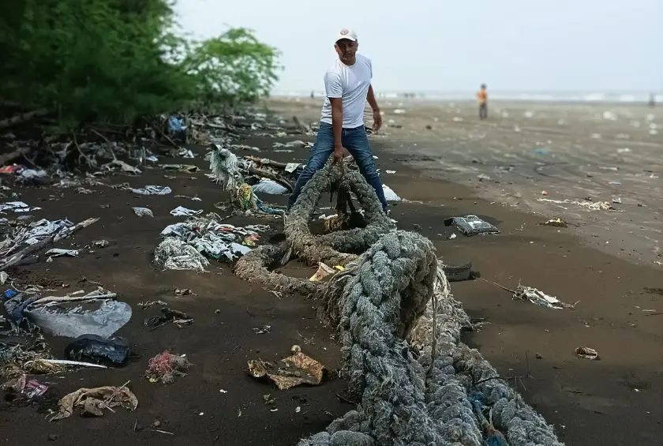
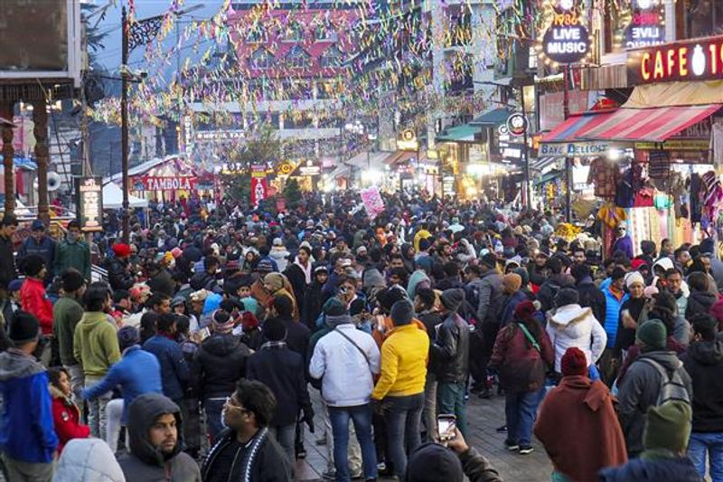
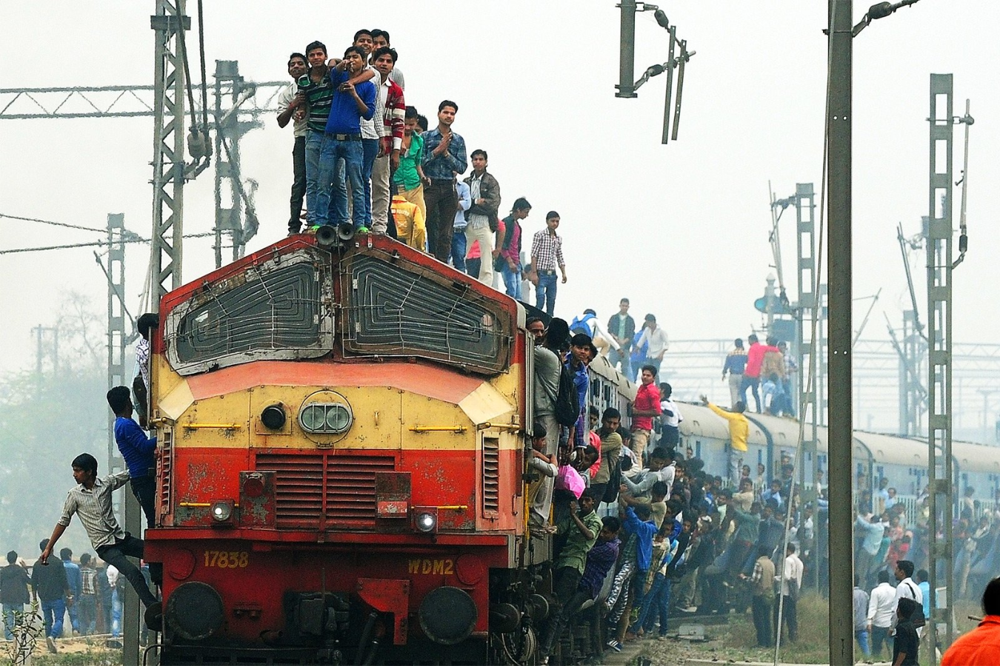

I have been to Europe, USA, Middle East and East Asia. Every time I come back from there to India, there is one question I think really hard on

:::question
Why can't we be like them? What is stopping us?
:::

After discussing a lot with people around me, I feel I have root caused it to three primary concerns. They determine the course of action we as a nation take in terms of the most minuscule thing you can imagine:

- Education
- Population
- Scarcity

:::question
What are we missing?
:::

## Education

While even the most uneducated in our society gained access to internet in a _very short span of time_, their primary usage has been:

- [Scrolling and Cheap Dopamine](https://blog.king-11.dev/posts/scrolling-death/)
- Looking into the life lead by riches
- Getting **brain washed** by radical sections

:::quote
"The highest education is that which does not merely give us information but makes our life in harmony with all existence." — Rabindranath Tagore
:::

And I can say very well after seeing people be unaware about **waste management** and **nutrition** that this hasn't happened yet.

:::question
A Prime Minister had to start a whole movement just to teach people not to throw garbage around and did they learn anything?
:::

Education isn't about the degree that is very easily **purchasable** and gainable from rote learning. It's about components that help adults navigate their lives, things like:

- Mental Wellness
- Public Etiquette
- Substance Abuse
- Career Guidance
- Financial Planning
- Sexual Health

:::important
Overall, our education lacks the right set of tools for us to be [happy](https://blog.king-11.dev/posts/pursue-happiness/).
:::

The response when somebody asks people not to be self indulgent and take care of their society and environment is generally a stark reply with:
:::quote
“I’m not doing much. There are people doing worse.”
:::

## Population

Combined with lack of education and being the largest _proud_ producer of human kind we have **crippled** ourselves on our own.

There is only so much resources available. While people might say there is plenty for everyone..._to be honest_ there isn't. I wonder if **Thanos**, the mad titan was also born in a parallel world similar to India.

In one of my favorite books [Anxious People](https://www.goodreads.com/en/book/show/49127718-anxious-people) the author had said
:::quote
“The most expensive thing you can buy in the most densely populated places on the planet is distance.” (Fredrik Backman, Anxious People)
:::

This line has stayed with me because this is exactly what we are suffering from. To have a spacious house/flat, visit someplace less crowded and have a chance at some breathing space all you have to do is **pay more**.

A very large population also leads to the scariest of competition and fight for survival. They say _"survival of the fittest"_, but all I hear is that **"you will have to fight for everything"**. A job, education, food and shelter.

:::tip
You slack off you lose, that is the rule in India.
:::

[Collaboration, not competition](https://blog.king-11.dev/posts/collab-to-top/) is what keeps things healthy but with a population our size there is competition _even_ for collaboration.

## Scarcity

I think everyone has at least once wondered why are people _getting up inside the plane_ as soon as it lands and why does nobody bother to follow sequential boarding.

:::info
I recently travelled from Bengaluru to Jaipur to surprise Papa on his birthday when I heard people at boarding say "Those who will follow sequence are the ones that will be left behind".
:::

Airport might still be a place where we meet a more civil crowd, but I have seen **stampede** of IT workers on a Thursday evening rushing to onboard a _BMTC Bus_ on ORR, that was **scary!**

I think we all would have seen images of applicants sitting on _roof of train_ to get to examination centers while risking their lives.

Parents are sending off their children from **standard 7th** to coaching institutes so that they are able to make into the _"prestigious institutions"_ where they would again learn on _"how to compete in the world"_.

:::warning
We are ruining their innocent childhood with rage of competition.
:::

All of the above actions are taken under **the threat of scarcity** due to our tremendously large populations. I am not sure when these thoughts became so _prevalent_ in our society. All Indian parents are teaching their children to take care of themselves without ever **bothering** about society.

:::important
One of our major cities, **Lucknow** taught its citizens about putting others first, as they fondly say in Hindi: _"pehle aap!"_
:::

Did we forget this? Who or what circumstances made us forget some of our core values? Maybe it was the **British Rule**, that made everything so scarce for Indians. And yet, after so many generations we still haven't been able to let go of that ideology.

### Second Order Effect

I think Scarcity isn't really a first-order effect; it arose from growth in population and simultaneous lack of infrastructure/resources to cater to everyone's requirements.

The cycle of **scarcity** and **corruption** feed each other in an endless loop:

- A corrupt society causes disproportionate _distribution_ of resources leading to a wider scarcity mindset
- A scarce society can _possibly_ lean into corruption to ensure their own well being over others

:::quote
"The world has enough for everyone's need, but not enough for everyone's greed." — Mahatma Gandhi
:::

## Conclusion

Can we pull ourselves out of this mindset? Maybe, with a decline in population growth rate we might see more equitable access to resources.

I feel the **quality of life** we experience in India can only improve once we resolve our education and population issues, not like Thanos but maybe like **China**. The very country we are taught to _despise_, which faced the same population pressure and pollution issues pulled itself out.

:::question
Why can't we?
:::

When that day finally comes to be we might finally be able to start asking right questions to our **elected** and **executive bodies** related to our food quality, financial stability, pollution, infrastructure, public transport, etc.

Until then we have to _wing it_, maybe our generation can bring about that change. Hopefully we will all come to see that day in our lifetime at least.

:::quote
I believe that change can only be brought about if we decide to be aware, learn, and execute on an individual level.
:::

Thanks for reading, I had been holding this blog for sometime because I didn't want to come out too **negative**. At the same time I don't want to hold back ideas that I want people to ponder upon and discuss with me.

Cover Photo by <a href="https://unsplash.com/@nisarg_ch">Nisarg Chaudhari</a>.
