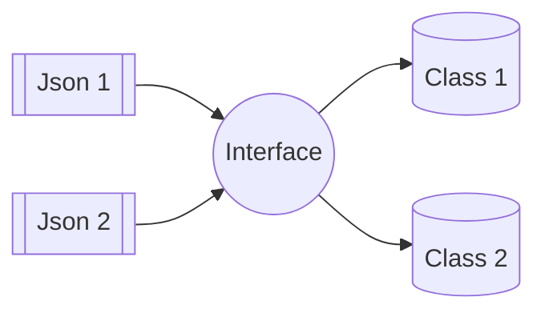

I have been encountering more and more *aha moments* while working with **Jackson Annotations** primarily because we usually don't write _tests_ for stuff like serialisation and deserialisation of JSON because the code is way too trivial to have tests for and who even does that, right?

But these kinds of issues can **break production** ~~already did once~~. So here is everything I have figured out until now around serialisation of records/classes/empty beans, deserialisation along with property naming and the interesting case of interfaces with concrete types.

## Serialisation Annotations
A Java class is serialisable for Jackson if it belongs to any of the below scenarios.

### POJO Class
If it's a normal Java class then it needs to have public fields, as only fields which are public will be visible in the serialised format of the class.
```java
public class DatabricksDashboard {
	public String dashboardId;
	public String deploymentName;
}
```

:::note
In case you don't want to make the fields public then you need to add `JsonProperty` annotation on each one of the fields that you want to be present in the JSON output.
:::

### Record Class
It is a record class that provides out of the box serialisation and de-serialisation; so no annotation is required.
```java
public record DatabricksDashboard(
	String dashboardId,
	String deploymentName) {}
```

### Renaming Fields
We can rename field names present in serialised JSON using `JsonProperty("<NEW_NAME">)` annotation.

To create the JSON object that looks like
```json
{
	"dashId": "1234",
	"dpName": "cache-key"
}
```

We can define our records or even class by giving the `JsonProperty` annotation to field declarations
```java
public record DatabricksDashboard(
	@JsonProperty("dashId") String dashboardId,
	@JsonProperty("dpName") String deploymentName) {}
```

:::tip
`record` classes are good candidates for schema/model objects.
:::

### Empty Beans
Jackson's `ObjectMapper` by default fails to serialise a class with no public fields or as Jackson likes to call it, an empty bean (legacy of Spring Boot). There are two workarounds for it:
- Allowing classes with empty fields for `ObjectMapper`
```java
private static final ObjectMapper objectMapper =
	new ObjectMapper()
		.configure(SerializationFeature.FAIL_ON_EMPTY_BEANS, false)
```
- Adding a `JsonSerialize` annotation on individual class
```java
@JsonSerialize
public class EmptyClass {}
```

Either of the above is fine to use; it depends mostly on whether there is only one `ObjectMapper` instance you need to change or multiple.

## Deserialising Annotations
Deserialisation of JSON into a Java class happens through its constructor. Jackson maps the fields present in the JSON object to the keys present in class constructor.

Let's try to deserialise a JSON object that looks as below
```json
{
	"dashboard_id": "1234",
	"deployment_name": "captcha-check"
}
```

We need to add the annotation of `JsonCreator` to the constructor function responsible for generating our class from the JSON object input.

:::tip
`record` classes don't need a `JsonCreator` annotation for primary constructor.
:::

For each field in our JSON input, we have to annotate the respective constructor argument with `JsonProperty`.
```java
public class DatabricksDashboard {
	public final String dashboardId;
	public final String deploymentName;

	@JsonCreator
	public DatabricksDashboard(
		@JsonProperty("dashboard_id") String dashboardId,
		@JsonProperty("deployment_name") String deploymentName
	)
	{
		this.dashboardId = dashboardId;
		this.deploymentName = deploymentName;
	}
}
```

:::note
Some people with a keen eye will note, that the serialised version of this class differs from the JSON we deserialise because we didn't add the `JsonProperty` fields for renaming [renaming fields](#renaming-fields)
:::

### Useful Annotations
Jackson has developed some pretty useful annotations for frequently encountered cases some of them that I use very often are:
- @JsonNaming(PropertyNamingStrategies.SnakeCaseStrategy.class)
- @JsonIgnoreProperties(ignoreUnknown = true)

#### JsonNaming
Given that in Java we prefer using camel case, our property declaration is done the same. Though it's possible that the JSON we are trying to deserialise uses a different case.

The way to deal with it is using [renaming fields](#renaming-fields) as we have already seen above but it gets too verbose in which case we can just make use of `JsonNaming` annotation.
```java
@JsonNaming(JsonPropertyNamingStrategies.SnakeCase.class)
public record DatabricksDashboard(
	String dashboardId,
	String deploymentName) {}
```

Now the above class can read JSON without any additional annotation that looks as below
```json
{
	"dashboard_id": "1234",
	"deployment_name": "cache-key"
}
```

Some of the useful naming strategies are:
- Snake Case
- Pascal Case
- Kebab Case
- Camel Case
Apart from these there is a whole set of combinations around upper and lower case to cater to other requirements.

#### JsonIgnoreProperties
The JSON payload we are trying to deserialise can have multiple properties that we don't really care about in our application logic. If we ignore those properties in our class, then Jackson will raise an error during deserialisation.

There are three ways to deal with this:
- Declare the field in `JsonCreator` constructor but don't assign it to any of the fields
```java
public record DatabricksDashboard(
	@JsonProperty("dashboard_id") String dashboardId,
	@JsonProperty("deployment_name") String _deploymentName) {}
```
- Update your object mapper to ignore unknown properties
```java
new ObjectMapper().configure(Feature.IGNORE_UNKNOWN, true);
```
- Add the `JsonIgnoreProperties` annotation to your class
```java
@JsonIgnoreProperties(ignoreUnknown = true)
public record DatabricksDashboard(
	@JsonProperty("dashboard_id") String dashboardId) {}
```

## Working with Interfaces
It's easy to work with concrete types (i.e. classes/records), because there is a 1:1 mapping between JSON payload and our class; but when it comes to interfaces there is n:n mapping that Jackson has to figure out.



To provide additional information to Jackson, we can use the `JsonTypeInfo` annotation. It will help Jackson figure out the right class while trying to deserialise the JSON into a concrete class object.

Let's assume we have a sealed interface for some dashboard information
```java
public sealed interface DashboardInfo
    permits DatabricksDashboard, SigmaDashboard {
  String id();
  String content();
}
```

Our interface is implemented by two record classes, each of them has some additional fields, apart from the ones that the interface asks for
```java
public record DatabricksDashboard(String id, String content, String deploymentName) implements DashboardInfo {}
```

```java
public record SigmaDashboard(String id, String content, String deploymentName, String creator) implements DashboardInfo {}
```

Now assume we have a serialised `List<DashboardInfo>`. How will Jackson know which class to deserialise each of the list objects into, while recreating the list?
```json
[
	{
		"id": "databricks-1",
		"content": "hello databricks",
		"deploymentName": "dbc-1234"
	},
	{
		"id": "sigma-1",
		"content": "for the ceo",
		"creator": "chief of staff"
	}
]
```

:::note
A question you might have is: why does it need to be a class that Jackson deserialises into, and not the interface itself? The reason is *each object is an instance of a class* not an interface!
:::

To add type information, we can add a new property in our JSON object which is distinct for each of our classes and helps Jackson figure out the right one. We do it using the `JsonTypeInfo` annotation.
```java
@JsonTypeInfo(
    use = Id.NAME,
    include = JsonTypeInfo.As.PROPERTY,
    property = "_type")
```

Now we also need to declare what the value is for each of our subtypes on our interface
```java
@JsonSubTypes({
  @Type(value = DatabricksDashboard.class, name = "databricks"),
  @Type(value = SigmaDashboard.class, name = "sigma"),
})
```

Our serialised `List<DashboardInfo>` will look as below now
```json
[
	{
		"id": "databricks-1",
		"content": "hello databricks",
		"deploymentName": "dbc-1234",
		"_type": "databricks"
	},
	{
		"id": "sigma-1",
		"content": "for the ceo",
		"creator": "chief of staff",
		"_type": "sigma"
	}
]
```

We chose to add these values manually but we can also go with something like `use = Id.CLASS` which just adds a new property with the fully qualified name of our class (i.e. `org.jackson.dashboards.DatabricksDashboard`)

:::warning
Class name itself can be too verbose in Java and also make the serialised JSON payload incompatible in terms of multi language compatibility.
:::

#### Concrete Types
In case you are deserialising directly into a concrete class and not your interface, then by default Jackson requires you to ensure that the the type information field is available in the JSON payload.

For example, we are aware that Databricks API will only return Databricks dashboard, but the JSON response from API won't have the type field that we declared for our internal usage.
```json
{
	"id": "databricks-1",
	"content": "hello databricks",
	"deploymentName": "dbc-1234"
}
```

Jackson being very strict, throws an `InvalidTypeIdException` in such scenarios. To prevent this error, we have to make this requirement optional in our `JsonTypeInfo` annotation on the interface.
```java
@JsonTypeInfo(
    use = Id.NAME,
    include = JsonTypeInfo.As.PROPERTY,
    property = "_type",
    requiredIdForSubtypes = OptBoolean.FALSE)
```

>A very curious thing to note is the use of `OptBoolean` enum here instead of something like `true` or `false`; this is because a value type like boolean can't be `null`. Also the Java compiler doesn't allow the use of `true` or `false` as these are Java keywords.
