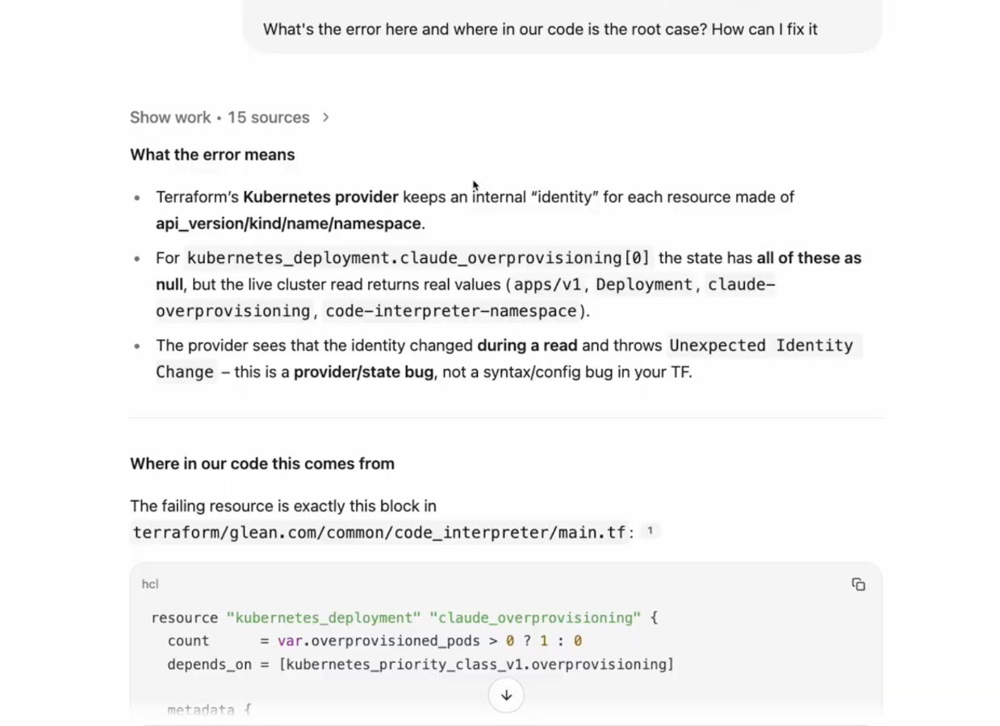
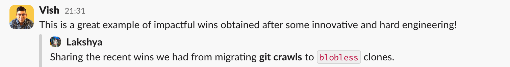
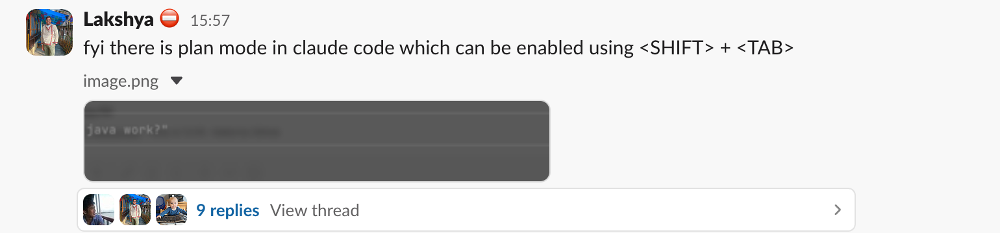
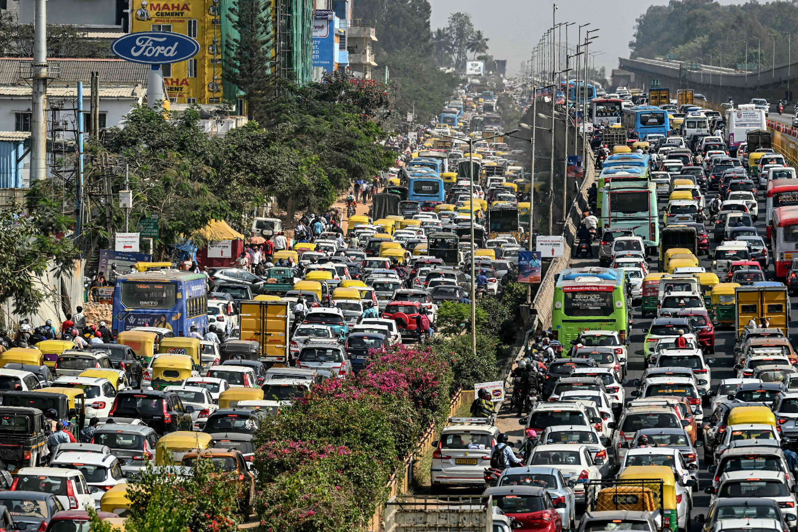

:::quote
Keep it private until it is permanent
:::

It seems permanent now so I thought why not pen down my thoughts about how exciting the journey has been for me at [Glean](https://www.glean.com). The last year in terms of my career revolved around:

- Settling into a high-paced environment
- Building reputation and taking ownership
- Developing connections with new colleagues
- Rethinking Work-Life Balance
- Living in the Silicon Valley of India

To say the least it has been interesting and riddled with new learning experiences for me on navigating my career and life together. Let's jump into it.

## Settling In

[When I left Microsoft](https://blog.king-11.dev/posts/why-i-left-microsoft/) to join Glean, I was definitely doubting my own capabilities on being able to settle into a high-paced engineering machinery.

I was afraid about whether I would be able to work alongside some of the brightest minds, given the talent density at Glean is just amazing. As I have started identifying it better, this was **impostor syndrome** showing up. It forced me to even work on weekends at times for the first few months in hope that by doing more I can deliver at same speed as other team members.

It took sometime, meanwhile _I broke production_ [using claude code](https://blog.king-11.dev/posts/claude-code/) and raised a few eye brows during my first `on-call`. But things have settled down. I am much more capable to steer the agents in the right way and handle escalations appropriately.

:::quote
It does not matter how slowly you go as long as you do not stop. — Confucius
:::

I think it's futile to push ourselves too much at the start of job, because people around you understand that humans need time to develop the necessary understanding, unlike AI agents. Also **we have to be kind to ourselves for the first few months** to prevent burnout and believe in our own capacity to deliver once the initial hurdle of getting context is resolved.

:::quote
Slow is smooth. Smooth is fast.
:::

Only after developing the understanding can we deliver at exponential speed. Maybe we can read or write more code but **real learning comes from experience**, encountering and discussing varied set of problems not just cramming things up.

What helped me a lot was being able to use Glean itself for gaining the necessary context and getting answer to my questions. We launched Agentic Looping with [code search](https://www.glean.com/blog/code-search-code-writer-jan-drop-2026) a few months after my joining and it's far more superior at being an `Assistant` now than before.

The other crucial thing was making use of the privilege that comes with a `monorepo`. While builds and CI might be a bit slow, we get a chance to look around the code and build mind map of interaction between things without needing to ask some other service owner.

## Building Reputation

The more projects you can deliver without facing backlash or delays, the more are your chances for being asked to work on an interesting project and maybe even have your _"pick of the litter"_.

Delivering more inclusive of both boring and interesting projects is what builds your reputation up gradually. Engaging in things like:

- Driving projects yourself
- Help in unblocking others
- Going deep into things
- Technical design discussions and reviews

:::quote
I fear not the man who has practiced 10,000 kicks once, but I fear the man who has practiced one kick 10,000 times. — Bruce Lee
:::

It's important to develop deep knowledge to be **"the person"** for generating clarity around at least one and a few topics if we are being ambitious. For me it was picking up a piece the team had least engagement with, [optimizing it](https://blog.king-11.dev/posts/partial-git-clone/) and making it production ready which resulted in my work being _shared by our CTO with the whole company_.

When I went to US office someone who I had never engaged with before called me the `Claude Code` guy because I was one of the first movers in our company at adopting these tools and started sharing my **learnings** including **failures**.

Driving projects completely involves finding problems, drafting initial solution, discussion with team to reach a final solution, implement it, release it and in future be responsible to jump in and resolve issues around the project.

:::important
Driving projects yourself, doesn't mean we can't ask for help from others.
:::

## Developing Connections

When I was leaving Hyderabad one of my AOL friend told me it gets tougher to bond with people at higher stages of job when you change companies. The energy and desire to bond that is very dominant in New College Grads starts receding over time.

A quote I had highlighted in one of my favorite book, [The Art of Being Alone](https://www.goodreads.com/book/show/152297026-the-art-of-being-alone) is
:::quote
After college, you don’t make friends. You just network. You just try to be nice to people so you are not left behind (mostly).
:::

I found two really useful means to network:

- Using shared office cabs where we can engage with co passengers. The only time Bengaluru traffic becomes a blessing in disguise
- Sitting on random tables during breakfast and striking up conversation

Phil had a very interesting thought about the concept of [cheerleading](http://notes.eatonphil.com/2025-05-26-cheerleading.html) which aligns with how I also expect networking to look like.
:::quote
The easiest way for no one to give a shit about what you've done is for you to only interact at periodic intervals that are only convenient for you.
:::

**We should engage with people even when we don't have to.** It can be small conversations about hey you have been away for sometime, how was your trip, did you see Sunday's Grand Prix?, etc.
:::info
F1 is the hottest topic on our team's lunch table.
:::

Showing interest in other people's lives is the easiest way to build connection. There are some very irritating people out there who can't stop speaking about themselves. Don't be that person, let people share their experiences too.

We are human beings at the end of the day who want to talk beyond business and customers. Even if you don't see the value in networking from career aspect do it for the sake of being human.

## Rethinking Work-Life Balance

I used to have very strict boundaries about Work-Life Balance at Microsoft. I was completely unavailable after 5PM every weekday for any form of work related discussions.

With Glean I had to rethink this primarily because when you work in a startup the best advantage you have against big tech is the **first mover benefit** and **confidence of customers**. To retain those you have to respond fast when things break and send out new features quickly.

Now things can break anytime at 8PM/10PM and even weekends. You might have to respond based on urgency. Only a few weeks back I was sitting in a meeting on **Saturday Evening** with our CTO Vish, my manager, teammate, Gitlab's CIO and Director of AI Engineering along with a few other folks to speed things up for a launch.

I have since transitioned into a more flexible routine but I make sure to do things that I have to for myself without a miss which includes:

- Hitting Gym every alternate day
- Having meals on time
- Worshipping in the morning
- Meditation on alternate day
- Spending time with my family & friends
- Going on a lot of trips
- Making time for reading, cooking and badminton, etc.

:::quote
Man sacrifices his health in order to make money. Then he sacrifices money to recuperate his health. — Dalai Lama
:::

Work is allowed to chip away at my after work hours sometimes but it isn't allowed to break me away from my priorities, that would always be **me, my health, my family and friends**, because [your happiness always comes first](https://blog.king-11.dev/posts/pursue-happiness/#your-happiness-first).

Doing work on weekends or after hours isn't a norm and shouldn't be! It's only for the time when shit hits the fan and in my team at Glean we always try to root cause and improve our systems so that same kind of `escalations` don't get a chance at our time again.

## Living in Bengaluru

Okay no filters, _I hate this the most_. I can't imagine ever settling down in this city, the chaos, the rush, the infrastructure, rental situations and traffic of course is definitely not suitable for anyone's peace of mind. Cherry on top is all the language issues.

Hyderabad was so much better and I wish more people and companies start choosing it. The only part that has kept me sane in Bengaluru is I get to visit my friends over weekend and live with my best friend.

Maybe it's just me not having figured out a better way to live in Bengaluru and find the right community circles. Most of the people seem to be only into stuff like smoking, drinking and clubbing. I know I can go for hikes and technical meetups but it requires so much of energy compared to somewhere like San Francisco where I could just walk around and find places to enjoy nature.

If you are someone who has figured out the right communities in Bengaluru I could definitely use pointers. But yeah ISTG _am not enjoying my stay in this city_.

## Wrap Up

I definitely wouldn't want to close on a negative note. So it's important I show some gratefulness for having a chance at being with my friends and working in a company that suits my way of work and also appreciates my contribution.

I joined as a Software Engineer at Glean. Over the past year, across two review cycles, I have paved my way to **Software Engineer II** last December. These are exciting times that we live in. Being in close proximity of AI innovation and working with some really smart people seems to be boosting my capacities as an Engineer.

As Buzz Lightyear would say:

Photo by <a href="https://unsplash.com/@khouser01?utm_source=unsplash&utm_medium=referral&utm_content=creditCopyText">Keegan Houser</a>.
