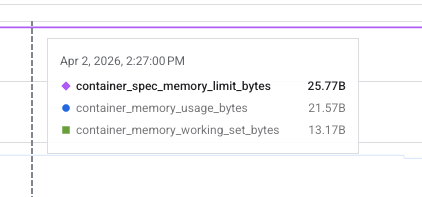
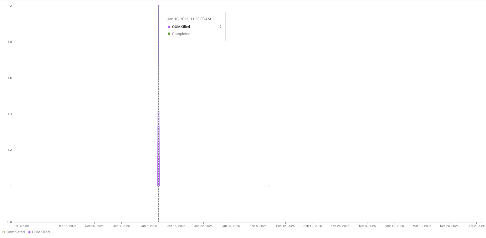

Most of us are well familiar with the fact how memory-intensive Java processes can be. The system needs to scale up as the memory usage increases but there is no such thing as infinite scalability which clouds talk about. The end result is Linux Kernel OOM Killer activating and killing the Java process.
```
[26553.503363] Out of memory: Killed process 1688 (java) total-vm:9704312kB, anon-rss:2365028kB, file-rss:4kB, shmem-rss:0kB, UID:0 pgtables:5824kB, oom_score_adj:0
```

At glean we run plethora of Java applications and one of them is [git crawler](https://blog.king-11.dev/posts/partial-git-clone/#existing-algorithm). In this blog, I will talk about how we made infrastructure changes — **memory limits**, **health probes**, and **automatic restarts** — to prevent OOM kills, improving availability of our git crawler by up to **7x** for some customers.
Let's get into it starting with first a brief introduction about the infrastructure we have in place for crawlers.

## Infrastructure
The original git crawler service is a Java app that runs as a docker container on VM hosted as Compute Engine (GCP) with Persistent Disk or EC2 Instance (AWS) with EBS Volume.

:::info
We are currently in progress of migrating our VM instances to Kubernetes StatefulSets to gain better observability and reliability for the service.
:::

For the K8s version we are using a statefulset with dynamically created persistent volume using storage class.

In case you haven't read the whole blog on [git crawler](https://blog.king-11.dev/posts/partial-git-clone/#existing-algorithm), the gist is git crawler is responsible for running `git` commands like `clone`, `log`, `pull`, etc which are very high in memory and have a IO bound nature.

## High Memory Usage
Due to the high memory nature of app it frequently had to face the wrath of Linux OOM Killer leading to the container being killed with a `SIGKILL` signal.

In case of a container running on VM we had to recreate the VM completely to make sure the setup script runs again and VM gets a clean state to begin crawling again. This requires a complete deploy operation using Terraform to rebuild the EC2 resource.

:::warning
The outcome was reduced availability of git crawler until we automatically start a new deploy operation.
:::

Things are much better in case of Kubernetes based statefulset service because there `kubelet` takes care of ensuring the running containers are healthy and if they die it brings them up automatically.
:::info
`kubelet` is the process that runs on every compute instance part of kubernetes cluster that monitors the workloads running on it to match the expected state of cluster as defined in specification.
:::


## Vanilla Docker Improvements
We realized later that we could achieve this parity in terms of automatic restarts while using vanilla docker also.

This was figured out quite late but we could pass in `restart` policy for a container being ran using `docker run`.
```diff
- sudo docker run -d -p 8080:8080 ${IMAGE_URL}
+ docker run -d -p 8080:8080 --restart=always ${IMAGE_URL}
```

With this in place we saw improvements in restart behavior but there was another issue — OOMs were destabilizing the whole VM instance.

### VM Destabilization
The destabilization as a result of memory hogging `git` commands would cause trouble for aws `cloud-init` and `ssm agent` process to start in the dearth of available memory.
```bash
aws ssm describe-instance-information --filters "Key=InstanceIds,Values=$INSTANCE_ID" --region $AWS_REGION
```

The output signaled that `PingStatus: ConnectionLost` so we can't even ssh into the EC2 instance for triaging. The only available way to support the claim was checking console logs
```bash
aws ec2 get-console-output --instance-id $INSTANCE_ID --region $AWS_REGION
```

The way to resolve this was adding memory limits for the docker container relative to total available VM memory, so that there is always some buffer for other processes to run along side the Java App.
```bash
TOTAL_MEM_KB=$(awk '/MemTotal/{print $2}' /proc/meminfo)
CONTAINER_MEM_MB=$(( TOTAL_MEM_KB * 80 / 100 / 1024 ))

docker run --memory="$${CONTAINER_MEM_MB}m" --memory-swap="$${CONTAINER_MEM_MB}m" -d -p 8080:8080 --restart=always ${IMAGE_URL}
```

We limited the docker container memory limit to `80%` of total available VM RAM size. This prevented the container from ever destabilizing VM with memory hogging as it would get killed and restart at 80% usage itself.

### GCP Stability
Git Crawler running on Google Compute Engine (GCE) was more stable than the AWS one. The differences were associated with the deployment abstractions we had in our GCP deployment.

One thing unique about GCE was that it ran containers on **Container Optimized OS** which was made specifically for running docker containers on VMs providing additional stability and auto resize capabilities.

:::info
Google Kubernetes Engine also uses [Container Optimized OS](https://docs.cloud.google.com/container-optimized-os/docs/concepts/features-and-benefits) (COS).
:::

In our abstraction any java service that wanted to run on COS based GCE was plugged in as a _systemd service_ providing automatic restarts using the kernel.

In AWS the docker container was just ran as part of the startup script — it wasn't a daemon, so it could die and never be restarted until `--restart` was added. This was the key difference in reliability between the two.

The other difference was GCP VM was a `e2-highmem-4` with 32Gi of available memory whereas AWS was a measly `t3.medium` with 4Gi memory. For this oversight the AWS git crawler used to suffer far more OOMs than GCP one.

We upgraded AWS instances to use `t3.xlarge` with 16Gi, as we have seen the load to be around ~12Gi.

:::important
Cost is an important factor to look at while selecting VMs given AWS is more expensive than GCP.
:::

### Uptime Improvements
:::quote
Talk is cheap show me the numbers!
:::

| Customer | Previous Uptime | New Uptime |
| :------: | --------------- | ---------- |
|    C1    | 0%              | 96.3%      |
|    C2    | 15%             | 96.9%      |
|    C3    | 76.7%           | 94.3%      |

The uptime is measured based on a health check, which runs every hour. So we are assuming the worst case of 1 hour downtime but in most cases of healthy operation it would be a few minutes as a result of deploy operation re-creating the VM.

:::tip
A reason to moving to K8s is rolling deploys where there is no downtime.
:::

## Kubernetes Health Probes
With VM-based deployments stabilized, we turned to our Kubernetes workloads where we wanted to go further — preventing OOMs entirely as recovery part is already taken care by `kubelet`.

For the statefulset we wanted to prevent ever reaching a state of OOM because you can never gracefully handle a `SIGKILL`.

:::info
`SIGKILL` is sent to process to immediately stop its execution. Under normal conditions process are sent `SIGTERM` with some grace before being sent `SIGKILL`.
:::

So we want to replace `SIGKILL` with a preemptive `SIGTERM`. We utilized [health probes](https://kubernetes.io/docs/concepts/workloads/pods/pod-lifecycle/#container-probes) which is what kubelet monitors and based on their state decides to recreate containers utilizing a `SIGTERM` to stop the existing one.

### Health Probes
Health probes are a way to run diagnostic check on the containers. There are three kinds of probes:
- **Startup Probe**: Process inside container has been initialized. On failure pod is killed and subjected to restart policy.
- **Readiness Probe**: Pod is ready to serve requests. On failure it's removed from the service endpoints.
- **Liveness Probe**: Pod is alive. On failure pod is killed and subjected to restart policy.

So, to shed the load we used readiness probe with a check on a memory used up to 90% by reading the `cgroup` counters.
```bash
# cgroup counter for memory utilized
MEMORY_USED=$(cat /sys/fs/cgroup/memory.current)

# cgroup counter for memory limit
MEMORY_LIMIT=$(cat /sys/fs/cgroup/memory.max)
# threshold at 90%
MEMORY_THRESHOLD=$(( MEMORY_LIMIT * 90/100 ))

[ $MEMORY_USED -lt $MEMORY_THRESHOLD ]
```

:::info
[cgroups](https://man7.org/linux/man-pages/man7/cgroups.7.html) (control groups) is the way through while linux processes are organized into hierarchies whose resource (cpu, ram, network, disk, etc) usage can then be monitored and limited.
:::

The files `memory.current` and `memory.max` are live counters containing value in bytes.
- `memory.max` stores the hard limit on memory for the cgroup.
- `memory.current` is the total amount of memory currently being used by the cgroup and its descendants.

:::bug
We saw that even after readiness probe removed the pod from service endpoints, the memory usage still didn't drop.
:::

### Memory Metrics
It is the responsibility of operating system to ensure that memory is always 100% utilized which is [good actually](https://planetscale.com/blog/high-memory-usage-in-postgres-is-good-actually) and for that it even keeps cache of file pages not actively used still in RAM.
:::info
A read from SSD is still 100x times slower than read from RAM.
:::

The metric we were reading was `container_memory_usage_bytes`


Since `container_memory_usage_bytes` includes inactive page cache, it overestimates actual pressure. So instead of looking at memory usage we had to look at working set memory as that is what is considered by [OOM killer](https://www.opstergo.com/blog/kubernetes-oom-killer-navigating-memory-challenge#:~:text=Container_memory_working_set_bytes%20is%20the%20primary%20measure,the%20basis%20of%20their%20analysis.) also as it evicts the inactive page caches.

The working set memory is defined as:
```bash
# inactive page cache
INACTIVE_MEMORY=$(grep '^inactive_file ' /sys/fs/cgroup/memory.stat | awk '{print $2}')
# working set = total - inactive
WORKING_SET_MEMORY=$((MEMORY_USED - INACTIVE_MEMORY))
```

:::info
The `memory.stat` file provides a breaks down of cgroup’s memory footprint into different types of memory (active_file, anon, kernel_stack, etc)
:::

The working set memory is still a loose definition of how much memory a process needs to operate. Even the so called _"active_file"_ pages might not actually be in active use.

:::important
The `active` page cache can also be [reclaimed](https://sourcegraph.com/github.com/torvalds/linux@v6.13/-/blob/mm/workingset.c?L27-30) when system is under pressure to prevent OOM by moving them to `inactive_file` set.
:::

### OOM Incidents
Final result was just no OOM event in **past 2 months** and the 2 before that was before we added health probes.


:::tip
We can also remove active page from our memory calculation to represent non page cache memory usage for read heavy processes as sourcegraph did for their [code search engine](https://sourcegraph.com/blog/beyond-working-set-memory-understanding-the-cadvisor-memory-metrics).
:::

## Conclusion
With increased uptime we are better able to crawl and include updates to code files in glean index making it a lovely place for me and other engineers to engage with code and understand it using chat assistant.

The learning primarily, I would say was around diffing a stable (GCP) and an unstable (AWS) system to realize the gaps and fixing those to get parity.

But the most interesting use case was using health probes for reducing the memory build up as that doesn't seem to be the intended use case for them but more like a clever use.

While researching for this blog I particularly found the [sourcegraph blog](https://sourcegraph.com/blog/beyond-working-set-memory-understanding-the-cadvisor-memory-metrics#:~:text=To%20help%20determine%20if%20this%20is%20the%20case%2C%20we%20also%20track%20the%20number%20of%20page%20faults%20through%20container_memory_failures_%20total%7Bfauilure_%20type%3Dpgmajfault%7D.) an insightful read to check for metrics which can provide details about whether the system needs more memory based on _page faults_. I am planning to add those in glean's kubernetes clusters and monitor for further improvements.

I have a few other kubernetes and resource exhaustion related blogs coming up soon. Till then thanks for reading and happy vibing :)


Cover Photo by [mr doorm](https://unsplash.com/@mrdoorm)
