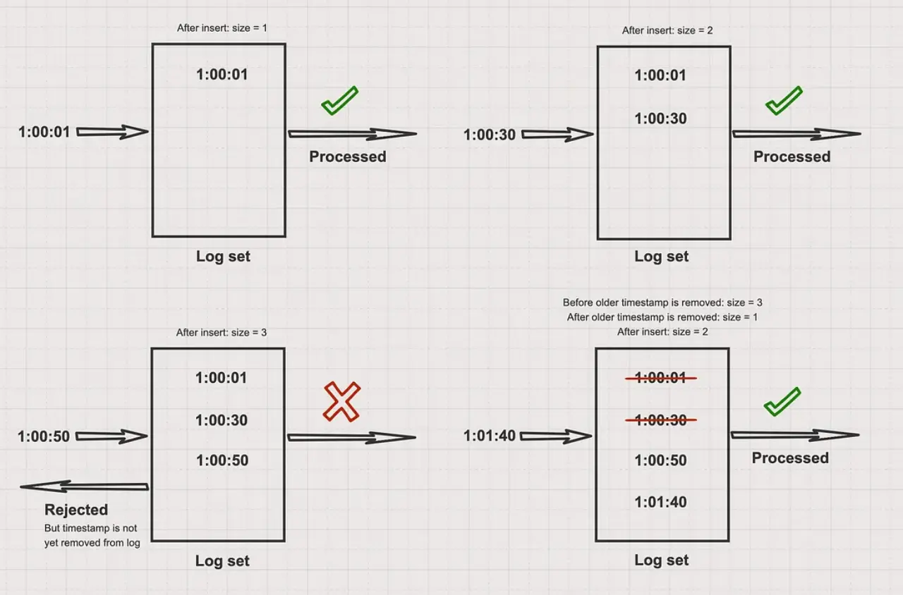
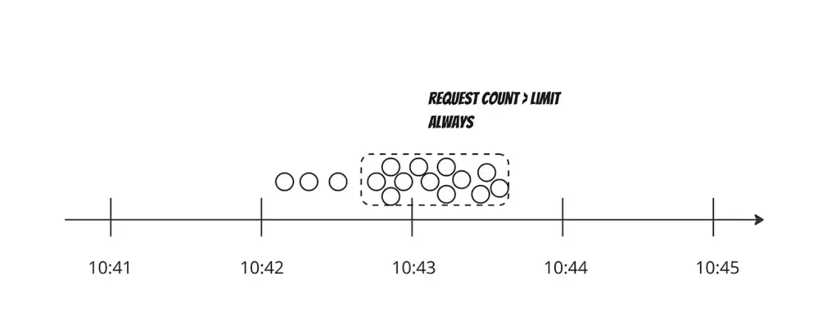

## Why to Rate Limit?

Rate Limiting is a crucial part of designing any API it maybe private or public. A rate limiter caps how many requests a sender can issue in a specific window of time. A rate limiter provides following features:
- Defense against a Denial of Service from malicious actors trying to pull down the service.
- Ensures the load on servers is always under maintainable state by discarding too many requests.
- Prevent broke developers from receiving an unexpectedly large bill in today's auto scalable cloud service offerings.


*I can relate with you Max :'(*

## Algorithms
Rate Limiting implementation can use different algorithms based on the requirement of our applications. Two key parameters are how we define our user (ip address, user id, device, etc.) and the second being our time window (1 minute, 1 hour, etc.)

### Token Bucket
In token bucket algorithm we have a fixed size bucket which keeps getting filled by tokens at a uniform rate. When a new request arrives it is only processed if we have at-least one token in the bucket, otherwise the request is dropped.

```mermaid
flowchart LR
	r(Request)
	t[[tap]]
	b[(Bucket)]
	c[/count > 0/]
	p((Process))
	d((Drop))

	r --> c
	t --> b
	b <--> c
	c -->|true| p
	c -->|false| d
```

### Leaky Bucket
In leaky bucket algorithm there is a fixed size queue where new requests are queued. These requests are then consumed at a uniform rate. A new request is dropped if bucket is a it's capacity.
```mermaid
flowchart LR
	r(Request)
	b[(Queue)]
	c[/!capacityFull/]
	p((process))
	d((drop))

	r --> c
	c -->|true| b
	c -->|false| d
	b --> p
```

Leaky and Token bucket algorithm are relatively simple to implement but on the downside it's difficult to find the right value for bucket size and token generation/request consumption rate.

### Fixed Window Counter
In fixed window counter we keep track of number of requests within a fixed time range e.g. a minute or 30 seconds etc. We only process a limited number of requests within the time window beyond which the requests are dropped (red ones).
```mermaid
gantt
	title Requests v/s Time
	dateFormat m:ss
	axisFormat %M:%S
	tickInterval 10second
	R1 :0:00,10s
	R2 :10s
	R3 :0:25,10s
	R4 :crit,0:40,10s
	R5 :crit,0:45,10s
```

The issue with fixed window counter comes around when there are requests coming near the boundary of two windows. In such a scenario we actually end up processing more request within time window than set parameter.
```mermaid
gantt
	title Requests v/s Time
	dateFormat m:ss
	axisFormat %M:%S
	tickInterval 10second

	R3 :0:30,10s
	R4 :0:40,10s
	R5 :0:45,10s
	R6 :1:00,10s
	R7 :1:00,10s
	R8 :1:20,10s
```

In the above example within time range of 00:30 - 01:30 instead of 3 the rate limiter allowed 6 requests which is double of what was expected of it to allow in a minute. O(2\*n)

### Sliding Window Log
Sliding Window log is a dynamic one which handles the previous faults in fixed window counter by keeping track of requests in the current time window which is updated with every new request. It also uses a log to keep track of current requests.

Whenever a new request arrives
- We delete all the entries older than current time window.
- Now request's timestamp is added to our log which now represents all the requests made in current time window.
- If the `len(log) <= rate` then we process the request else its dropped



Generally redis sorted sets are the used to keep track of timestamps in an efficient data structure which allows easy querying and updates.

Even with all its goodness its a little flawed due to the high memory usage. In case of a DoS attack we can have thousands of these log entries leading to huge memory usage and no valid requests will be processed in this duration these drawbacks lead us to the last algorithm.



### Sliding Window Counter
It is a hybrid approach inspired from fixed window counter and sliding window log. It takes the best part of both and combines them **sliding window ~~log~~ + ~~fixed window~~ counter**.

To fix the flaws of fixed window counter it uses a **weighted counter** to smooth out burst around window boundaries which takes previous and present window requests into account.
```python
percent = (cur_time - start_time_cur_window) / window_size

weighted_counter = requests_prev_window * (1.0 - percent) + requests_cur_window * percent
```

Liked sliding window log we need to use memory for keeping track of history. To count requests from each sender we will use multiple fixed time windows 1/60th the size of our rate limit’s time window like [figma](https://www.figma.com/blog/an-alternative-approach-to-rate-limiting/) does. This remedies the memory footprint issue limiting it to just 60 values for every user.
```
4 bytes per counter * 60 counters * 100,000 users = 24,000,000 bytes OR 24MB
```

To reduce our memory footprint, we can store counters in a Redis hash which are highly efficient in their [storage usage](https://redis.io/topics/memory-optimization). Each new request which increments the counter it can set the expiry for it based on our time window but still there is a possibility of DoS attack to remedy this we should clean up hashes at regular intervals if they are rapidly increasing.
```mermaid
flowchart LR
	r[request]
	i(increment counter)
	c[/weighted counter < limit/]
	re[(Redis)]
	p((process))
	d(drop)

	r --> i
	i --> c
	c <--> re
	c --> p
	c --> d
```

## HTTP Response
Now that we have rate limited user its also important to convey it back to the end user.
HTTP 429 - Too Many Requests is the status code which is created for this purpose. We can add in more details in HTTP Headers as well
- X-Ratelimit-Remaining
- X-Ratelimit-Limit
- X-Ratelimit-Retry-After


I wrote this blog to better my **understanding** as am currently reading the holy grail of system design: [The System Design Interview Book](https://www.goodreads.com/book/show/54109255-system-design-interview-an-insider-s-guide). I was never rate limited before but recently when I unfollowed over **1k** people on *Instagram* it rate limited me.

I made use of [mermaid diagrams](https://mermaid.js.org/) for the first time in my blog compared to using [excalidraw](https://excalidraw.com/). Mermaid is pretty cool, easy to use, keeps me inside the markdown and its just text so very easily transferable.

I hope I was able to share my understanding with you, **thanks** for your support till here. If you’ve enjoyed this read, please share it, to help others find it as well. Also, feel free ping me up for any comment on [@1108King](https://twitter.com/1108king)😁
