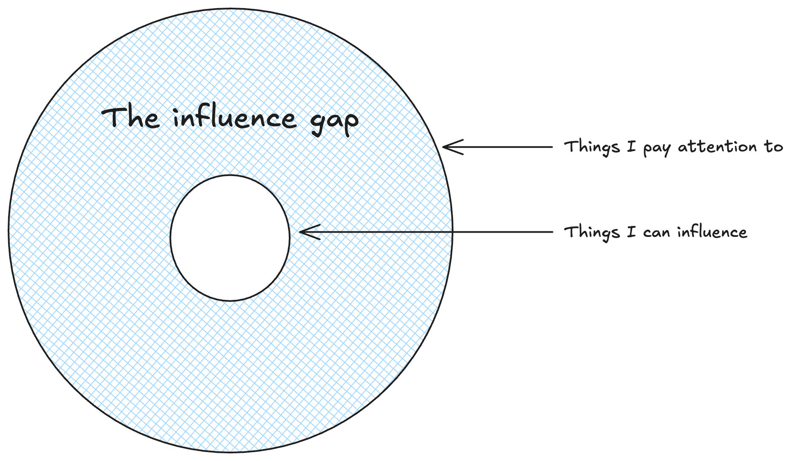
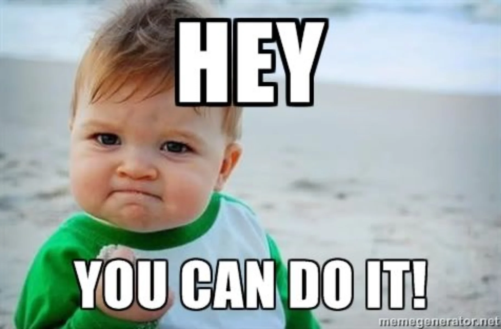

There was this famous book written during the TV era [Amusing Ourselves To Death](https://www.goodreads.com/book/show/74034.Amusing_Ourselves_to_Death?ref=nav_sb_ss_1_18) by **Neil Postman** in 1985. He predicted that society would succumb not to censorship as **George Orwell** wrote in "1984", but to *distraction* and *consumerism* as written by **Aldous Huxley** in "Brave New World".

:::danger
Scrolling ourselves to death is what it looks in today's world.
:::

I think it's important we tackle this problem of **decaying attention** spans and desire to be amused or entertained 24/7.

This article will cover details about **how** we lost to tech entrepreneurs and **what** we can do to get back the reins of our vagabond brain.

This article will not be covering the "**why**", it's something that each one of us has to sit with ourselves to figure out.

:::note
Time is your most valuable resource, in life and at work. You can't make more. You can't pause it from going by. You can only allocate it.
:::

The article is for those who feel that something is wrong in the way they are *consuming* content on internet and are finding themselves unable to gather attention for important tasks.

Let's begin with learning how did the Tech Industry use our primal behaviours to *hack* our neurological system, leaving it addicted to something that provides us **zero** value.

## Neural Hijacking
**Dopamine**, the feel good hormone, is the one that hijacks our brain into doom scrolling. We start scrolling in anticipation of finding something that might excite or entertain us and that is what keeps us going.

:::info
Dopamine is the same hormone that causes drug addictions.
:::

A small burst of dopamine when we do find something is what resets the cycle and starts everything all over again. In one of my favourite book, the [Dopamine Detox](https://www.goodreads.com/book/show/58503121-dopamine-detox), we call these systems as open. They endlessly feed our desire for dopamine high.

:::warning
I recently found out about this dark pattern, where everytime we try to exit Instagram it refreshes the feed so that we come back looking for our dopamine hits.
:::

There is another place of dopamine release, **notifications**. We react mostly involuntarily to these ding, buzz or banners. These notifications trigger a dopamine release in anticipation of a reward that the mysterious notification might hold.

:::error
Especially the Microsoft Teams caller tone and Slack ping are so traumatizing.
:::

The **red dot** and counter which shows the unread notifications is an open loop that we feel compelled to clear out. For someone like me who suffers from OCD and ADHD, things become even more difficult to withhold ourselves.

The overstimulation of our brain is what causes us to lose interest in the activities that once brought pleasure; it **desensitizes** us. We lose all interest in our day to day activities e.g. job, reading a book, long movie or sitting idly during travelling.

:::info
It was shown in a research that, [overstimulation of our brain leads to desensitization](https://doi.org/10.1016/j.neuropharm.2014.03.006).
:::

Knowing that our biological design is being hijacked by the digital world might leave us in despair, that nothing really can be done about it. This hopelessness breeds passivity which the tech industry feeds on.

:::important
When we're demoralized, we either keep feeding the system or we blame ourselves so harshly that we give up trying altogether.
:::

But let's not be bogged down by this knowledge. Instead, we can work knowing what is being targeted to protect our attention and receptors by making thoughtful, intentional choices in our lives.

## Self Control Myth
I don't think when the whole ecosystem is working against you it's possible to show good self restraint. It just doesn't work however much we try.

:::quote
There is no such thing as self-control.
:::

I feel it's better to give up control because our monkey brain and these primal desires are something that are bound to fail us.

For starters, I recommend you get an **accountability partner**—it can be a good friend or family member with whom you aren't afraid of embarrassing yourself. Ask them to monitor your screen time, attention sprints, etc.

### Notifications
I think this is the best thing I have done and you should too: **disable notifications** on WhatsApp, Instagram, YouTube, Slack, Teams, etc.—just disable them all. If there is no trigger for you to get into these open ecosystems you won't be going there *unintentionally* anymore.

:::important
If something is critical people will usually give you a call or enable explicit notifications for these very very important people in your life.
:::

The next step to reduce your numerous intentional visits to open ecosystems is to enable **app timers**. Both Android and iOS have them under the sections Digital Wellbeing and Screen Time.

Start with a sufficiently good time, maybe **30 minutes**, and then start reducing it over time, but don't be too harsh on your monkey brain—it will need time to adapt.

:::tip
Every time you increase the timer make sure to inform your accountability partner.
:::

### Regular Breaks
Now, I know some of you might have already tried timers and gotten used to disabling them every time they run out. As I said, there is no such thing as self-control, so give up and **uninstall the apps**.

It's important to allow other things (that you will discover when you are [bored](#bored)) a fair chance by removing social media apps (instagram, twitter, youtube, reddit, etc.).

By having a regular social detoxification period in our life, we will adapt to focus our energy on more important parts of our life even when we have these apps installed.

:::tip
I take this approach where I uninstall social media for the first week of every month.
:::

### Logging Off
There is another thing that should be done to develop a healthy relationship with social media. **Unfollow** all the celebrities and people who you don't really engage with as they aren't what you call **friends**.

:::warning
This idea used to work so well before but now instagram tries to push random posts and stories in my feed so that they can keep us hooked on the platform.
:::

Knowing about what is going on in the life of **Dua Lipa** or the hottest couple from your college isn't going to help your life in any way. This is one of the [arguments I put forth you for logging off](https://aaronfrancis.com/2024/an-argument-for-logging-off-9a4de45b), the central idea is either to reduce your attention circle or expand your influence circle.

[Why we can't stop scrolling](https://contemplationstation.substack.com/p/why-we-cant-stop-scrolling-and-how) is a very insightful read on the biological correlations to our smart phone addiction. A very important idea highlighted in the article is to decide the **intent** and **time** before you allow yourself access to the smartphone.

## Be Bored
The solution to scrolling dilemma is to get used to being **bored**. There have been so many **researches** that ask us to be bored because that is what we are trying to _cope_ with by scrolling on social media, but we shouldn't!

In case you are wondering why, the [Harvard Business Review](https://hbr.org/2025/08/you-need-to-be-bored-heres-why) might answer you better.

:::info
You will be much less bored with ordinary stuff (job, relationship, etc.) in your life if you get better at the skill of boredom.
:::

There are a lot more additional benefits too that helped the previous generation in figuring out their lives, but that's a separate discussion.

:::important
Boredom is a superpower
:::

Being bored feels weird, but that feeling is what makes you [progress better](https://www.youtube.com/watch?v=3IfxE55gQlM) in your life than you can wonder. **Lowering** our stimulation baseline and training our mind with boredom is the key to _thriving_ in the 21st century.

By allowing yourself to be bored, we make the most **boring tasks** like studying, strength training, reading, etc., the most stimulating tasks. These tasks are the ones that will actually cause the needle to move in our lives.

:::quote
All of man's problems arise because he can't sit by himself in a room for 30 minutes alone. - Blaise Pascal
:::

There was a [study](https://www.science.org/doi/10.1126/science.1250830) conducted by University of Virginia in 2014. Participants of the experiment were left alone in a room with nothing except a shock button. The end results were hilarious: **12/18** gave themselves at least one shock because _getting a shock is better than being bored_.

## Daily Rituals
Most of us have gotten used to the habit of looking up our phone **first thing** in the morning. Do you really think it's that important?

If your answer is **NO!**, then starting tomorrow, develop a habit of not looking at your phone for at least **one hour** after waking up. Allow your brain to be free from the distractions and noise.

If you have seen **F1 The Movie**, remember the scene where Pearce is glued to his phone, checking public sentiment, when Sonny finally tells him:
>It's all noise... just drive.

I related to the ideology very much; it's important to cut [the noise of social media](https://drmariakeckler.beehiiv.com/p/p35-it-s-all-noise-just-drive) from our lives to make a difference.

Now that we have sorted out mornings, there is another place I want your attention on: how we end our days? I won't be surprised if most of us put ourselves to sleep staring at our phones.

We are simple beings who are supposed to wake up at first light and put ourselves to sleep when it's dark. **Mr. Thomas Edison** added lights to our house but he never glued them to our eyes, which is exactly what phones do. Phones create an **illusion** for our brain that it's still not dark and we have to keep ourselves awake.

So, the thing I want you to do is keep your phone somewhere far from your bed or even outside your bedroom **one hour** before sleeping.

## Reaching Flow State
Cutting on all the noise makes it possible to attain the flow state. **Flow State** is the mode of our brain where creation just flows through our hands and we are unstoppable. It's the most productive and valuable time of my day.

To reach flow state, it's important to engage with whatever we are doing without getting distracted for **60-90 minutes**. While reels have made a dent in our attention span we can heal it again by engaging in long form activities again e.g. Movies (without checking your phone), Reading Books, Badminton, etc.

I learned a hack from my favorite book **[Make Time](https://www.goodreads.com/book/show/37880811-make-time)** to enter flow state. I have a playlist of 8 songs which I only listen to when I have to put myself in flow state. I put on my headphones and start playing it.

:::info
I had done the same activity before each of my interviews even before I read about it. Not to brag but I had a 100% success rate in my interviews.
:::

## Conclusion
I am by no means a saint. There are days when my screen time on my phone goes around *3-4 hours*, but what never happens is it going anywhere near **5-6 hours**.

While writing this blog, I had a sudden *realization* that while I see feeding on _reels_ and _shorts_ as wrong, here I am feeding my brain **novelty** by continuously consuming long-form content like blogs, YouTube videos, movies, etc.

In all honesty, it's still better than short-form content which makes you lose the habit of sitting down, but it's still no good if I'm not being a **creator** and just continuously consuming, aka _"Amusing ourselves to death"_.

All the ideas I have listed down in this article are a culmination of ideas I collected by reading multiple blogs (hyperlinked) and some of my favorite books, e.g., [Almanac of Naval Ravikant](https://www.goodreads.com/book/show/54898389-the-almanack-of-naval-ravikant?ref=nav_sb_ss_2_8), [Dopamine Detox](https://www.goodreads.com/book/show/58503121-dopamine-detox?ref=nav_sb_ss_4_11), [Make Time](https://www.goodreads.com/book/show/37880811-make-time), etc.

Every blog that I write and book that I read is only made possible because I try to **focus** my attention on writing my thoughts rather than consuming content on the internet.

It's not magic; it's the science of **intentional choices and decisions** that makes you reach where you want to be in life. So, take the reins of your monkey brain away from the tech industry and rebuild the focus.

Cover Photo by <a href="https://unsplash.com/@camstejim?utm_content=creditCopyText&utm_medium=referral&utm_source=unsplash" rel="noreferrer" target="_blank">camilo jimenez</a> on <a href="https://unsplash.com/photos/people-using-phone-while-standing-qZenO_gQ7QA?utm_content=creditCopyText&utm_medium=referral&utm_source=unsplash" rel="noreferrer" target="_blank">Unsplash</a>
