I have completed 24 (0-based indexing :P) circles around the Sun at this point. The most important thing I know today is that _surviving, fighting, and continuing_ in your life are not easy. The world we live in has so many peculiarities and issues, but to all of us who are alive and breathing, cheers 🥂!

I wanted to write about things that I have learned and unlearned over these 24 revolutions. So here I am, sharing 24 of them.

## Principles

Always make decisions and choices in your life while keeping this priority order in mind:
- Health
- Relationships
- Job

You can't have it all! Any critical decision in your life will come with **trade-offs**. Choose what feels right to you in the moment, because most decisions are rarely [permanent](https://jack-vanlightly.com/blog/2025/7/22/the-cost-of-being-wrong?s=09).

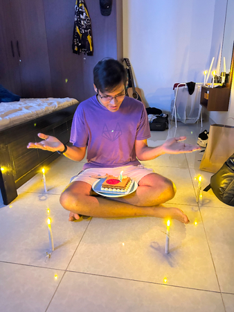

Get a grip on your life and take the driver's seat _after you get a job_. Don't let your parents, relatives, or partners be the _steerer of your life_. [Own your decisions](https://www.youtube.com/watch?v=jiHZqamCD8c), make mistakes, and learn from them; that is the only way to grow.

## Relationships

Don't try to befriend 100 people. _"Find your people"_, not necessarily a group, but the few people you want to be with when you are happy or sad. Don't just stop there: **prioritise** them in your life, [make time](https://www.goodreads.com/en/book/show/37880811-make-time) for them, listen to their stories, and tell them you love them. 🫰

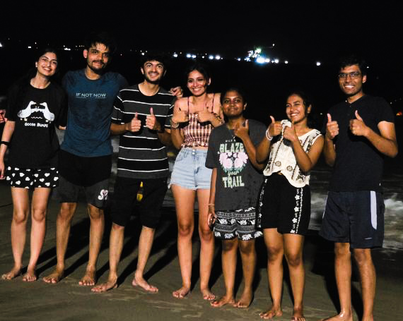

Don't just reach out to people when you need something. Build actual connections, be a [cheerleader](https://notes.eatonphil.com/2025-05-26-cheerleading.html), and reach out to people in your network once in a while without **any secondary motive**.

_"Closure is overrated"_. Nobody can give you what you owe yourself. **Forgive** yourself and the other person, because that is the only way to go forward without a heavy heart, and because you are meant for so much more.

Nothing is _permanent_ in life. Everything, from partners, friends, and family to jobs, is **ephemeral** and can be lost in the stream of life. Cherish it while it lasts.

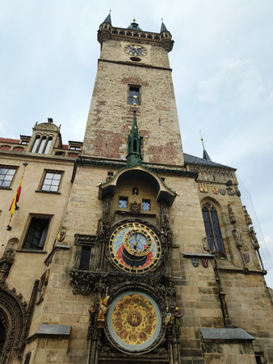

## Inner Life

Lower the bar for your [happiness](https://blog.king-11.dev/posts/pursue-happiness/) and build _simple desires_ that are easily achievable. That might be something [boring](https://www.youtube.com/watch?v=3IfxE55gQlM), like listening to your favourite playlist, meditating, eating dessert, talking to your favourite person, taking a stroll near a lake or in a garden, or just sitting quietly with yourself.

Don't expect life to always be filled with joy and happiness because _"only the absence of light can teach us its true value"_.
:::important
Life is like a sinusoidal wave, full of crests and troughs, with hope and despair in equal measure.
:::

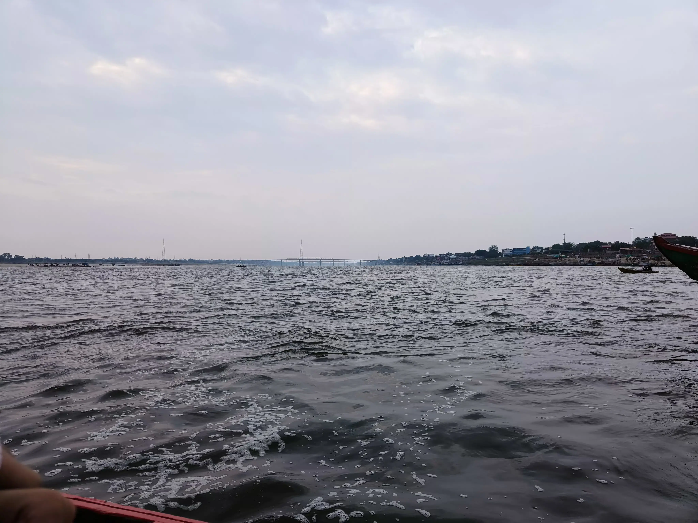

Sit down with yourself and spend **10 minutes a day** without any _noise from the world_, yes, not even music. Just you and your thoughts. Understand yourself before venturing out to understand other people and the world.

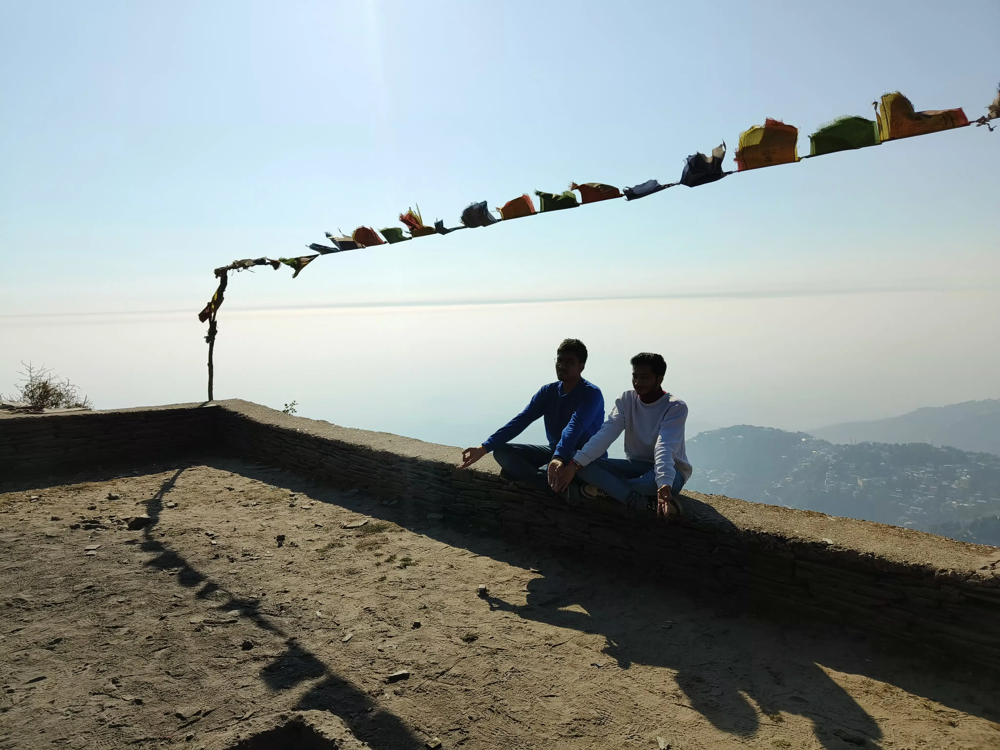

[Give it five minutes](https://signalvnoise.com/posts/3124-give-it-five-minutes?s=09): don't start shooting the first thought that comes to your mind. Think it through, think in second order, think before reacting, and sit with the thought.

Don't give in to the _definition of productivity_ that society has created for us. Build your own idea of productivity, one that isn't **draining** and is aligned with the outcomes you want in life.

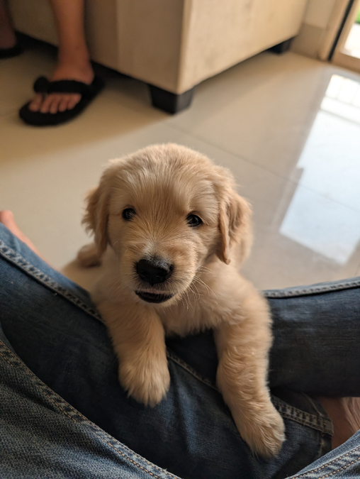

:::warning
Cheap dopamine, like [scrolling](https://blog.king-11.dev/posts/scrolling-death/), is one of the most expensive things in the world.
:::

## Learning

Taking this one from one of the best teachers the world has ever seen:
:::tip
Fall in love with some activity, and do it! Nobody ever figures out what life is all about, and it doesn’t matter. Explore the world. Nearly everything is really interesting if you go into it deeply enough. - [Richard Feynman](https://x.com/readswithravi/status/2047879269473206394?s=20)
:::

**Friction** is one of the prime forces behind our learning. Your managers might want you to keep building new features at the speed of thought, but NO! You can't learn without actually doing things and investing time in them, because [some things just take time](https://lucumr.pocoo.org/2026/3/20/some-things-just-take-time/).

Start **reading**! It need not be a _revolutionary_ self-help book; just read for the fun of it. Find a _genre_, whether fiction, rom-com, fantasy, thriller, psychology, or horror, that excites you to the point where you can't put the book down.

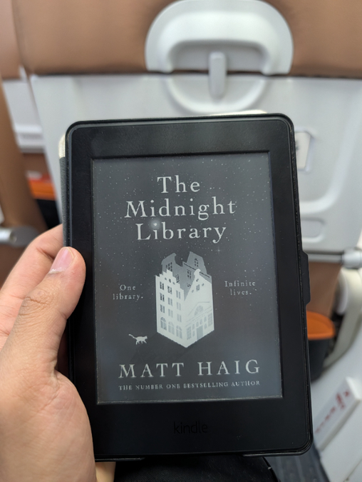

Build **[taste](https://paulgraham.com/taste.html)** in art, movies, TV shows, code, articles, books, and every other kind of creation. Have opinions beyond your personal preferences; to build taste, you need to dive head-first into exploring and [tinkering with things](https://seated.ro/blog/tinkering-a-lost-art).

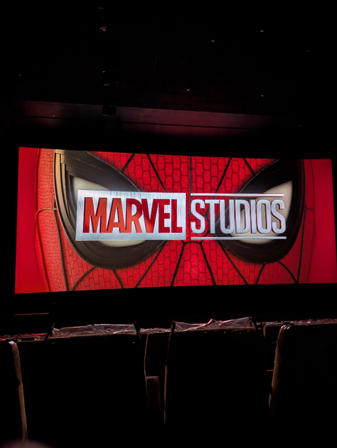

## Health

Go for strength training, running, racket sports, swimming, CrossFit, dancing, or yoga. It doesn't matter _what_ you choose; just work up a sweat **three times a week**, every week. Your body will thank you in your 40s.

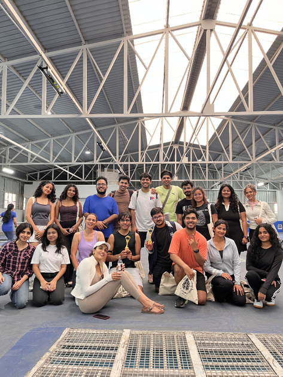

Track your **vitals**. Get a **fitness band**, such as WHOOP, Fitbit, Apple Watch, Garmin, or Oura; anything works. It just has to be something that tracks how your body responds to your daily routine, so you can start improving those metrics. Also, don't forget yearly or half-yearly **full-body check-ups**.

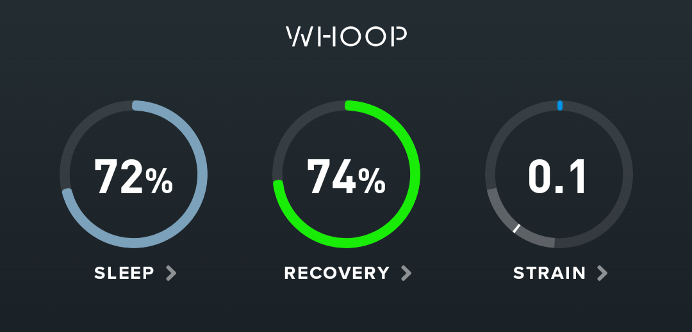

Don't try to outsmart health issues, as I did! Go see a doctor when necessary and consistently follow the prescribed course of treatment.

Teach yourself **cooking**. Start with simple recipes that will prevent you from ordering food every time your stomach rumbles. It will also help you avoid **adulterated food**, which is so prevalent these days.

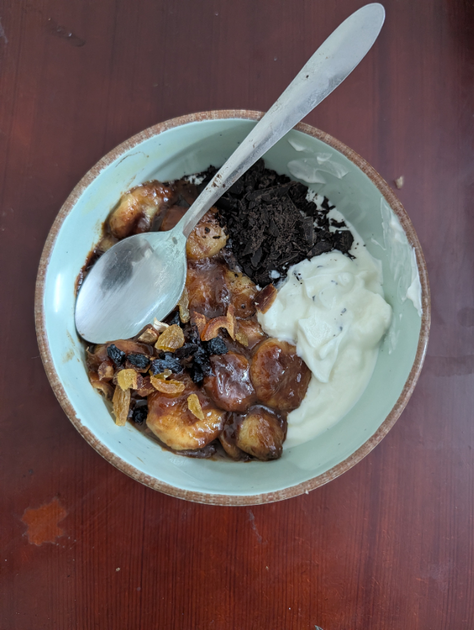

**Stop smoking**, just don't! It is one of the _cheapest, most addictive, and most easily available_ forms of **substance abuse**. The people around you, your loved ones, and your lungs will thank you.

## Experiences

**Travel** in every way and to every place possible. Go solo, go with your partner, go with your friends, or go with your family. Just go!

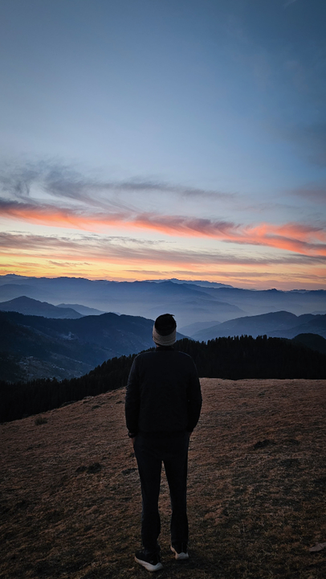

_Collect experiences over material objects_, because they will become the memories that flash before your eyes during your **last few moments** on this planet.

Believe in **[via negativa](https://coffeeandjunk.com/via-negativa/)**: negative experiences are there to teach you, not to be pondered over forever or used to view yourself with undue sympathy. Finding what is wrong is much easier than finding what is right.

## Conclusion

Enough said. I am very **grateful** for the life I am leading at the moment and have led in the past. This includes all my travels, friends, jobs, education, and experiences. There is still a lot to do, and _I am just getting started!_

Thanks for reading. The blog has been on hiatus for some time, but hopefully I am getting everything back on track, including consistent writing.

Cover photo by [Dino Reichmuth](https://unsplash.com/@dinoreichmuth) on [Unsplash](https://unsplash.com/photos/yellow-volkswagen-van-on-road-A5rCN8626Ck)
