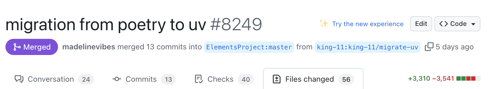
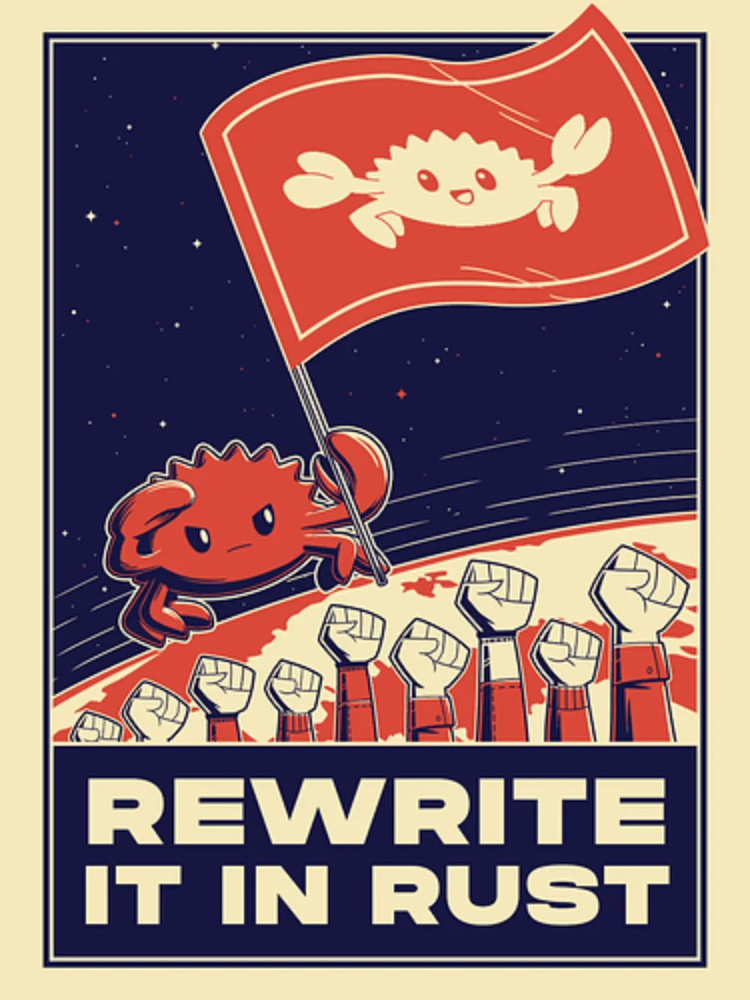

I recently did a [big migration](https://github.com/ElementsProject/lightning/pull/8249) by switching the Python package manager of Core  Lightning from `poetry` to `uv`. The reason was that `uv` is just better at managing large Python projects by handling their virtual environments, dependencies, scripts etc.



:::important
This PR gave me rights to name the next Core Lightning release. I have named it "Hot Wallet Guardian".
:::

This change took **4 months** to finally land in the release, at times I was travelling or iterating on understanding python package management better which is pretty _nuanced_.

So, plan for this article is to cover details about this migration and how you can also do it for your projects covering things like:
- Modifying `pyproject.toml` for standardisation
- Workspace management
- Namespace sharing of packages

But before all that, a little context will help to better understand why we needed this change in the first place?

## Context
We maintain docker images for Core Lightning in our [VLS Containers](https://gitlab.com/lightning-signer/vls-container) repository. For managing the Python dependencies we were doing global installs with `pip` and `requirements.txt` available in core lightning repository.

But Shahana [removed](https://github.com/ElementsProject/lightning/pull/7437) `requirements.txt` and were planning to only rely on [pyproject.toml](https://github.com/ElementsProject/lightning/pull/7437) specific to `poetry`.
>Removing requirements.txt from clnrest and wss-proxy plugins due to their ever changing dependencies. We will only be dependent on pyproject.toml for more stable results.

We weren't planning on adding `poetry` as a **runtime** dependency in our container images because `poetry` pulls in a lot of dependencies, bloating our *lean*, alpine-based container images.

:::note
Thinking about it now we can just use Poetry in our intermediate build layer to export a `requirements.txt` using `poetry-plugin-export`.
:::

So, it was recommended that we can explicitly install the dependencies using `pip` and that is what we did in our upgrade to [v24.08.2](https://gitlab.com/lightning-signer/vls-container/-/commit/f32537f94c45a68376adefc795a43cda8976fef6).
```diff
- RUN pip3 install -r /usr/local/src/plugins/clnrest_requirements.txt
+ # cln rest dependencies
+ RUN pip3 install --user json5 flask flask-restx gunicorn pyln-client flask-socketio gevent gevent-websocket flask-cors
```

By being explicit we got a lean docker image, but this made the plugin integration _brittle_ because we won't be aware of dependency changes over the time until something breaks.

[Christian Decker](https://github.com/cdecker), one of the leads at Blockstream [suggested](https://github.com/ElementsProject/lightning/issues/7665#issuecomment-2419044125) that plugins can be treated as `uv` scripts by specifying the dependencies in the Python file itself. The benefits that  `uv` carries with it:
- It manages python environment on its own
- Pulls in dependencies at an ultra fast speed
- Removes the need for a `pyproject.toml` file for small scripts

I had made the [change](https://gitlab.com/lightning-signer/vls-hsmd/-/commit/ed222795a04d1223a5080f1dbec809d39464ea06) in our integration tests to use `uv` recently because it is much faster than `poetry`. There we used `poetry-plugin-export` to generate a `requirements.txt` file on the fly and then give it to `uv` for dependency resolution as below
```bash
uv venv --python 3.12
uv tool install poetry
source .venv/bin/activate
uv pip install poetry-plugin-export
hash -r
uv pip install --no-deps -r <(POETRY_WARNINGS_EXPORT=false poetry export --without-hashes --with dev -f requirements.txt)
```

:::note
We use `hash -r` here to refresh the shell cache so that Poetry plugin is available for access.
:::

So, given I had already done it with our `CI`, I was more than happy to do it for core lightning as well.

:::tip
Never back down from a chance to contribute to large scale projects.
:::

## Automated Migration
Before writing this blog, the basic migration of `pyproject.toml` files ridden with `poetry` specific keys was done for me by my beloved claude code. Although there was a better way, by using the below command
```bash
uvx migrate-to-uv <PROJECT_DIR>
```

It does handle migration pretty well, migrating all the poetry keys to standard python specification.

So is that it....? Well, no, because what is the fun if everything was automated and we could head to the Himalayas.

:::warning
What `migrate-to-uv` tool can't do is create workspace definition and namespace sharing.
:::

These were things that needed figuring out and also why not _learn_ the python specification a little.

## Standard `pyproject.toml`
A standard `pyproject.toml` file has a top-level `[project]` key which specifies the following things related to package:
- name
- license
- version
- authors
- python version

And the most importantly, **dependencies**.
```toml
[project]
name = "dummy-project"
version = "0.11.0-rc.1"
license = "MIT"
authors = [ { name = "Christian", email = "christian@mail.org" } ]
requires-python = ">=3.9,<4.0"
dependencies = [
	"grpcio>=1,<2"
]
```

:::note
To read up more on the specification head to the [documentation](https://packaging.python.org/en/latest/guides/writing-pyproject-toml/#writing-pyproject-toml)
:::

### Optional Dependencies
Optional dependencies are used to pull additional dependencies required for the working of optional features, which consumers can opt into.

```toml
[project.optional-dependencies]
grpc = ["pyln-testing"]
```

Package consumers can then enable the feature by specifying it during installation
```bash
uv sync --extra grpc
```

### Dependency Groups
Dependency groups are used to specify a set of _development_ dependencies.

These aren't packaged in the final build unlike optional dependencies that are available for consumers.
```toml
[dependency-groups]
dev = [
	"pytest>=7.0.0",
	"mypy>=0.931",
	"pytest-custom-exit-code==0.3.0",
]
```

We can then configure our environment with development dependencies using the below command
```bash
uv sync --group dev
```

### Scripts
To install a command as part of our package specification we use `[project.scripts]` section.
```toml
[project.scripts]
poetry = "poetry.console.application:main"
```

In the above example, what it does is something similar to running below Python command directly
```bash
python -c "import sys; from poerty.console.application import main; sys.exit(main())"
```

You can refer to the [code](https://github.com/python-poetry/poetry/blob/1c059eadbb4c2bf29e01a61979b7f50263c9e506/src/poetry/console/application.py#L640), as Poetry is open-source. It should also make it clear why it's slow as compared to `uv`, because its written using native Python and not **rust**.



## UV Workspace
A workspace allows sharing of common dependencies by creating a shared lock file. We define it using `tool.uv.workspace.members` in the top level `pyproject.toml` file.
```toml
[tool.uv.workspace]
members = [
	"contrib/pyln-testing"
]
```

To make it possible for workspace packages to refer to each other we need to define them in `sources` with source set to workspace rather than `PyPI` or another registry.
```toml
[tool.uv.sources]
pyln-testing = { workspace = true }
```

## Namespace Sharing
This is something unrelated to `uv` specifically but it was required to handle multiple packages with [shared namespace](https://packaging.python.org/en/latest/guides/packaging-namespace-packages/) of `pyln` for the migration.

We can have two packages with name as:
- pyln-testing
- pyln-proto
```bash
lightning
├── contrib
├── pyln-proto
│   ├── pyln
│   │   ├── __init__.py
│   │   └── proto
│   │       └── __init__.py
│   ├── pyproject.toml
│   └── README.md
├── pyln-testing
│   ├── pyln
│   │   ├── __init__.py
│   │   └── testing
│   │       └── __init__.py
│   ├── pyproject.toml
│   └── README.md
├── pyproject.toml
├── README.md
└── uv.lock
```

Now when referring to them in actual code, we will use something like this
```python
from pyln.proto import *
from pyln.testing import *
```

The shared `pyln` prefix is what we call a package namespace. If we don't explicitly add support for both the namespaces then in our final `wheel` file only one of these will exist, the other will get overridden.

To _extend_ the namespace with both the packages we have to add additional instructions in our `__init__.py` present in `pyln` folder of both the packages.
```python
__path__ = __import__('pkgutil').extend_path(__path__, __name__)
```

In case you have packages like
- pyln-spec-bolt1
- pyln-spec-bolt2
then you need to add `extend_path` for both the common namespaces `pyln` and `spec`.

:::note
We can instead just omit the `__init__.py` at namespace level and things will just work for Python versions 3.3+ but in case your package needs to support Python 2 you need to use `pkgutil` style `__init__.py`.
:::

Along with this we also need to specify in build system that it should use the nested package present in `pyln` directory instead of something like `src`.
```toml
[tool.hatch.build.targets.wheel]
packages = ["pyln"]
```

## Packaging Problems
Apart from this, there were a lot of other package and build issues I had to resolve for this change to land:
- `coincurve` build issue which were happening due to missing `LICENSE` file  so had to change it to a lower version
- `libffi` was required for `bsd` build of `coincurve`
- `grpcio-tools` was not able to build on macOS CI and needed the below flags along with an `openssl` installation
```bash
export GRPC_PYTHON_BUILD_SYSTEM_OPENSSL=1
export GRPC_PYTHON_BUILD_SYSTEM_ZLIB=1
```

## Conclusion
`uv` definitely makes it bearable to use Python these days, no more chaotic dependency and virtual environment management.

The company behind uv, [Astral](https://astral.sh) is making even more blazing fast Python tools which everyone must definitely check out. The one I am most excited about is a new type checker and language server for Python, [ty](https://github.com/astral-sh/ty).

That's all folks _"Hot Wallet Guardian"_ is in its [release candidate 4](https://github.com/ElementsProject/lightning/releases/tag/v25.09rc4) and now that Python package management has been standardized we should all agree to **STOP USING `requirements.txt`!**


